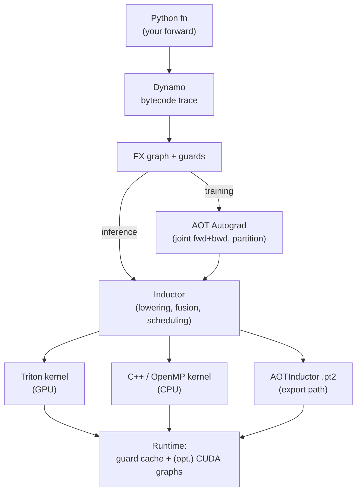

# Level 2 — torch.compile internals, from black box to surgical tool

> Outer reference: [`compiler-and-kernels/README.md`](../README.md)
> Prerequisite: Level 1 ([`level-1-triton-deep-dive/`](../level-1-triton-deep-dive/README.md)) — you should be able to read a Triton kernel and know what HBM bandwidth means.

`torch.compile(model)` looks like a single line. It is a four-stage compiler stack that intercepts your Python bytecode, traces it symbolically through both forward and backward, lowers the result through a scheduler, and emits Triton (or C++, or CUTLASS, or CuTe-DSL) — and then has to manage a guard-checked cache of variants at runtime because your shapes change every batch. Treating it as a black box is the reason most people get a 1.05× speedup, decide the feature "doesn't work," and go back to eager. Treating it as a stack you can inspect is the reason vLLM v1 compiles a LLaMA-70B forward in one Dynamo trace, wraps the attention boundary in a piecewise CUDA graph, and serves at ~95% of hand-tuned C++ throughput.

This level takes you from "I have used `torch.compile`" to "I can read what Dynamo emitted, find the four graph breaks in a real transformer, read the Triton that Inductor produced, register a custom kernel that survives compilation, and implement the vLLM piecewise CUDA graph pattern from scratch." The throughline is one model — a LLaMA-shaped transformer block — that you compile naively (breaks everywhere), audit (find the breaks), fix (one technique per break), and finally wrap in piecewise CUDA graphs the way vLLM v1 does.

By the end the capstone is **a working piecewise CUDA graph wrapper around a real LLaMA decoder block**, benchmarked against eager, default `torch.compile`, and full CUDA graph capture. The wrapper code is structured to be liftable into your own project — not toy code.

## What you need before starting

- Level 1 finished, or equivalent Triton fluency.
- A Google Colab account (free T4 GPU) suffices for ~90% of this level. `torch.compile` does not need Hopper.
- An M5 Mac (or any CPU) works for sub-modules 01, 02, 03, 04, 06 — the Inductor C++ backend on macOS compiles fine. Sub-modules 05, 07, and the capstone need a CUDA GPU for the CUDA graph numbers to mean anything.
- PyTorch ≥ 2.8 (released August 2025). PyTorch 2.9 (Oct 2025) and later are also fine. Earlier versions are missing `nested_compile_region` and the new Inductor graph partition. Install:
  ```
  pip install --pre torch --index-url https://download.pytorch.org/whl/nightly/cu124
  pip install depyf
  ```

## The current torch.compile landscape (May 2026)

The `torch.compile` stack moved fast 2024–2026. If you read anything older than ~12 months you will absorb stale APIs and outdated mental models. The state of the world right now:

- **PyTorch 2.8 (Aug 2025)** introduced `torch.compiler.nested_compile_region`. You mark a repeated sub-module (a transformer block) once; the compiler compiles it once and stamps it out for the rest of the stack. This drops cold compile time on a 32-layer LLaMA from ~120 s to ~20 s. ([release notes](https://pytorch.org/blog/pytorch-2-8/))
- **Inductor graph partition for CUDA graphs** also landed in 2.8 — Inductor automatically splits at CUDA-graph-unsafe ops (CPU ops, `.item()`, custom ops marked unsafe) and graphs each partition. This is the in-tree version of what vLLM had been doing by hand.
- **CUTLASS and CuTe-DSL Inductor backends** are now selectable for GEMM autotune (`max_autotune_gemm_backends = "ATEN,TRITON,CUTLASS,CUTEDSL"`). CuTe-DSL templates exist for Blackwell SM100 only as of 2.8.
- **`triton_op` is the right way to wrap custom Triton kernels.** The older pattern of bare `@triton.jit` + `torch.library.custom_op` + `register_fake` works but is opaque to Inductor — `triton_op` is transparent and lets Inductor inline and fuse around your kernel.
- **vLLM v1's piecewise CUDA graph design is the production reference.** Documented in [`docs.vllm.ai/en/latest/design/torch_compile/`](https://docs.vllm.ai/en/latest/design/torch_compile/) and the [Aug 2025 vLLM blog](https://blog.vllm.ai/2025/08/20/torch-compile.html) by Govedič, Zou, Stevens, You, Goin, and Zelenović. Attention is wrapped as a custom op (`torch.ops.vllm.unified_attention_with_output`) so Dynamo treats it as one node; the rest of the graph is split into pieces around it; each piece gets its own CUDA graph. This is the pattern you reimplement in the capstone.
- **AOTInductor is mature.** `torch.export` + `torch._inductor.aoti_compile_and_package` produces a `.pt2` archive you load from C++ or Python with near-zero startup cost — relevant whenever cold start matters (multi-model serving, autoscaling).
- **GraphMend (Sep 2025, [arXiv:2509.16248](https://arxiv.org/abs/2509.16248))** is a source-level compiler that auto-rewrites code to remove graph breaks. Useful as a reference for what kinds of patterns *can* be auto-fixed and which can't.
- **`depyf`** is the inspection tool that opens the box. Authored by Kaichao You (Tsinghua, also the vLLM piecewise CUDA graph lead). It dumps every Dynamo-transformed bytecode, every FX graph, and every Inductor-generated kernel to readable Python files. You will use it in every sub-module.

We pin **PyTorch 2.8 or newer** for this level. Where 2.9 / 2.10 APIs differ they are flagged inline.

## How the torch.compile stack actually works — the minimum you need



*Each layer's output is the next layer's input. Graph breaks fork the path at Dynamo; AOT Autograd is bypassed for inference; the runtime is what every call hits after compile.*

Six things. Plain English.

**Dynamo intercepts your Python bytecode.** When a `torch.compile`'d function runs, CPython's bytecode evaluator is replaced by Dynamo for that frame. Dynamo executes the bytecode symbolically — pretending tensors are placeholders — and accumulates an **FX graph** of the tensor ops. When it hits something it cannot symbolically execute (a Python `print`, a `.item()` call, a data-dependent `if`), it cuts the graph there — a **graph break** — runs the offending code in normal Python, then resumes tracing on the other side. Each piece is compiled independently.

**Guards turn the FX graph into a cache key.** The FX graph is only valid for the specific shapes, dtypes, devices, and Python values Dynamo saw. Dynamo emits a **guard** for every assumption ("input 0 is bf16 cuda:0 of shape `(B, S, 4096)` with `B=1, S=128`"). On the next call, the guard is checked; if it passes the cached compiled code runs; if it fails Dynamo retraces. Recompile too many times (default 8) and Dynamo gives up and falls back to eager forever.

**AOT Autograd traces forward and backward into a joint graph.** If you compiled in training mode, the FX graph Dynamo produced is fed into AOT Autograd, which traces through the autograd machinery to produce a single joint forward+backward graph, then partitions it back into a forward and a backward. This is why training compilation is harder than inference: the backward is an artifact of the autograd engine, not something you wrote, and bugs there are obscure.

**Inductor lowers FX to kernels.** Inductor takes the (possibly partitioned) FX graph and emits actual code. Default backend is **Triton on GPU, C++ on CPU**. Inductor does pointwise+reduction fusion, picks tile sizes, autotunes matmul backends (ATen / Triton / CUTLASS / CuTe-DSL), and emits an `output_code.py` you can read. This is the file that, once you can read it, demystifies the whole thing.

**The runtime layer is a guarded cache of compiled variants.** When the function is called, the runtime: (1) checks guards, (2) selects a cached variant or compiles a new one, (3) for Inductor-compiled regions, optionally wraps in CUDA graphs to amortize launch overhead, (4) executes. When people say "torch.compile is fast on steady state but slow on cold start," this is the layer they mean.

**`mode=` controls what optimizations run.** `"default"` is balanced. `"reduce-overhead"` adds CUDA graph capture (big win for small batches, ~free memory cost). `"max-autotune"` benchmarks every matmul backend at every reachable shape — best steady-state perf, multi-minute compile time. For LLM inference, `reduce-overhead` is the usual baseline; production engines do something smarter than `max-autotune`.

Everything else in this level is a consequence of these six facts. The single most useful follow-up reading is Edward Yang's [State of torch.compile for training (Aug 2025)](https://blog.ezyang.com/2025/08/state-of-torch-compile-august-2025/).

## What this level is not

We are not training you to **write** a new Inductor backend or rewrite Dynamo. That is `pytorch/pytorch` core dev work and a year-long arc on its own. We are training you to **read what the stack produces, diagnose when it misbehaves, fix it by changing your code or wrapping things correctly, and reach the level where you can implement the vLLM piecewise CUDA graph pattern from scratch on a real model.** That is what production inference work actually demands.

## What you build, topic by topic

| # | Folder | What you build | Hardware |
|---|---|---|---|
| 01 | `01-mental-model-of-the-compile-stack` | Annotated diagrams + a one-page diagnostic. No code yet. | none |
| 02 | `02-dynamo-bytecode-and-fx` | Tiny model → `depyf` dump → read the Dynamo bytecode and FX graph by hand | CPU works |
| 03 | `03-graph-break-detective` | Six deliberately broken snippets → diagnose with `_dynamo.explain` → fix each | CPU works |
| 04 | `04-reading-inductor-output` | Take an Inductor `output_code.py` for a fused norm+gelu+matmul and read it line-by-line vs your hand-Triton version | T4 |
| 05 | `05-dynamic-shapes-and-recompilation` | Variable-seqlen decode loop → watch recompiles → fix with `mark_dynamic` → measure | T4 |
| 06 | `06-custom-triton-in-compiled-graphs` | Wrap a Triton RMSNorm (your Level 1 kernel) with `triton_op` + meta kernel → compile around it → verify no graph break and Inductor fuses around it | T4 |
| 07 | `07-aotinductor-and-cold-start` | Export a model, load it from Python and (optional) C++, measure cold-start latency vs JIT `torch.compile` | T4 |
| _capstone | `_capstone-piecewise-cuda-graphs` | LLaMA decoder block: audit, fix breaks, implement piecewise CUDA graph wrapper, benchmark vs eager / compile / full-graph capture | T4 |

Sub-modules 01–03 are no-skip foundations. 04 is the demystifier — most learners' first time *actually understanding* what torch.compile emitted. 05 is the production reality of LLM serving (variable seqlen breaks naive compile). 06 is the bridge to Level 1 and to writing your own kernels into compiled models. 07 is the cold-start story. The capstone is the level — everything else feeds it.

### 01 — Mental model of the compile stack

You read the section above and the deeper exposition in [`01-mental-model-of-the-compile-stack/CONCEPTS.md`](01-mental-model-of-the-compile-stack/CONCEPTS.md), then answer the diagnostic in that folder's [README](01-mental-model-of-the-compile-stack/README.md). The diagnostic is six questions. If you cannot answer them, every later sub-module will read like spell-casting. If you can, you have the scaffolding to absorb the rest.

### 02 — Dynamo bytecode and FX graphs, with depyf

The single highest-leverage moment in this level: the first time you watch a four-line Python function get transformed into Dynamo-rewritten bytecode and an FX graph and you can *read both*.

You write a 10-line model, wrap it with `depyf.prepare_debug`, run it once, and open the dump directory. There you find:

- `full_code_for_<fn>.py` — the original Python.
- `__transformed_code_for_<fn>.py` — the bytecode Dynamo rewrote, decompiled back to Python so you can actually read it.
- `__compiled_fn_<n>.py` — the FX graph, then the Inductor-lowered code.

You annotate each file with what you see. You spot the **guards** at the top of the transformed code (the `___check_type`, `___check_obj`, shape checks). You see the FX graph nodes one-to-one with the tensor ops in your model. You see Inductor's `output_code.py` with the Triton kernels at the bottom.

Then you deliberately add a `print(x.sum())` mid-function and re-dump. You see Dynamo cut the graph in two: one compiled region before the print, an eager region for the print, a second compiled region after. Two FX graphs, two `output_code.py` files. The graph break becomes a thing you can see, not a slogan.

This sub-module runs on CPU. No GPU needed.

### 03 — Graph-break detective

Six minimal snippets, each broken in a different canonical way. For each you do the same drill: run with `fullgraph=True`, read the error, run `torch._dynamo.explain`, identify the cause, apply the right fix, verify with depyf that no break remains.

The six breaks, ordered by frequency in real codebases:

1. **`.item()` in a conditional.** Fix: lift `.item()` out, or use `torch.cond`, or set `capture_scalar_outputs = True`.
2. **`print` / Python logging inside forward.** Fix: `reorderable_logging_functions`, or remove, or `torch.compiler.disable`.
3. **Data-dependent `if x.sum() > 0:`.** Fix: `torch.cond` (rare), or restructure so the predicate is shape-derivable.
4. **Hugging Face-style `**kwargs` plumbing with optional `Cache` objects.** This is the LLaMA-in-Transformers break. Fix: pin the cache type, or `error_on_graph_break` selectively.
5. **`tensor.tolist()` / numpy round-trip.** Fix: keep it in tensor-land.
6. **A custom Python class without a registered tensor subclass.** Fix: `pytree.register_*` or just unbox at the call site.

For each fix you write three sentences in `notes.md`: what the underlying cause is, why the fix works, and whether the fix is free or has a real cost (some fixes — e.g. `torch.cond` — add a small constant overhead).

GraphMend's [paper (arXiv:2509.16248)](https://arxiv.org/abs/2509.16248) catalogs ~80 patterns it can auto-fix. We do not run GraphMend — instead you fix six by hand so the patterns become muscle memory.

### 04 — Reading Inductor output

You pick a small forward — `Linear → RMSNorm → GeLU → Linear` — and compile it with `TORCH_COMPILE_DEBUG=1` so Inductor dumps everything to `/tmp/torchinductor_<user>/`. You open `output_code.py`.

What you find is a Python file with two or three `@triton.jit` kernels and a `call(args)` driver that schedules them. You read it line by line:

- The first fused kernel: the elementwise+reduction op (RMSNorm's `mean(x*x)` fused with the divide and the GeLU). One HBM read, one HBM write.
- The matmul: either ATen (cuBLAS), a Triton template, or a CUTLASS template — depending on shape and autotune state. You see how Inductor picked.
- The driver: the `def call(args)` function that's literally what gets called every step. Arguments are the activations and weights; the function dispatches to the JIT kernels with the right grid and block sizes.

You compare this fused kernel to the equivalent hand-Triton kernel you wrote in Level 1's sub-module 03 (RMSNorm). Side by side, in `notes.md`, you answer: did Inductor fuse the same set of ops? Did it pick the same tile size? Where does each version win? You will usually find Inductor is within 10–20% of your hand kernel and sometimes beats it; the cases where it loses are educational.

This is where most "torch.compile is magic" feelings get replaced by "torch.compile is a competent kernel author with no domain knowledge of my model." Once you read three of these, the magic dissipates.

### 05 — Dynamic shapes and recompilation

The single most common reason `torch.compile` "doesn't work" for LLM inference: the seqlen changes every batch, Dynamo recompiles every batch, you exceed `cache_size_limit = 8`, Dynamo gives up and silently falls back to eager forever.

You build a small decode loop with seqlens varying from 1 to 256. You run with `TORCH_LOGS="recompiles"` and watch the recompilation log spew. You see eight guards fail, then the message that Dynamo has stopped trying. You measure: latency is now strictly worse than eager because of the wasted compile time.

Then you fix it three ways and measure each:

1. **`torch._dynamo.mark_dynamic(input_ids, 1)`** — tell Dynamo the seqlen dimension is symbolic from the start. Dynamo specializes on `dtype/device` only; one compile, many shapes. Measure recompile count drop from 8+ to 1.
2. **`dynamic=True` on `torch.compile`** — the broader-strokes version of the above; sometimes worse because it tries to make *every* dim symbolic. Compare.
3. **Bucket your shapes.** Compile for fixed `seqlen ∈ {16, 32, 64, 128, 256}`, pad to the next bucket. This is what vLLM does for CUDA graph capture. Measure: steady-state latency at each bucket.

You also encounter **`SymInt`**: an integer that Dynamo carries through the graph symbolically rather than specializing on. You can read SymInt expressions in the FX graph (`s0 * 4096` instead of `128 * 4096`). When something downstream needs a concrete int — e.g. a kernel grid — Dynamo will either resolve it at runtime or, if it can't, force a recompile. Reading the resulting FX graph teaches you what shapes Dynamo successfully kept symbolic and which it specialized.

Reference reading: PyTorch's [Dynamic Shapes guide](https://docs.pytorch.org/docs/stable/torch.compiler_dynamic_shapes.html) and Ian Barber's [Dynamic Shapes in PyTorch (Apr 2025)](https://ianbarber.blog/2025/04/04/dynamic-shapes-in-pytorch/).

### 06 — Custom Triton kernels inside a compiled graph

You take the RMSNorm kernel you wrote in Level 1, sub-module 03 (the autotuned single-pass version), and you make it compose with `torch.compile` correctly.

Two patterns exist; you implement and compare both:

**Pattern A: `torch.library.triton_op` (recommended, PyTorch 2.5+).** You wrap the kernel-launching Python function with `@triton_op("yourlib::rmsnorm", mutates_args={})`, call the kernel via `wrap_triton(kernel)[grid](...)`, and Inductor is allowed to *trace into* the wrapper. This means Inductor can fuse epilogue ops onto your kernel where the math allows it.

**Pattern B: `torch.library.custom_op` + `register_fake`.** The older, more opaque pattern. Inductor treats your kernel as a black box — it cannot fuse around it. You write a meta kernel (the "abstract impl") that says: given input shapes/dtypes, what are the output shapes/dtypes? This is needed because Dynamo's FakeTensor mode runs your function with no real data; without a meta impl it does not know what to do.

You verify with depyf that:
- Pattern A produces one FX node that Inductor can see into; epilogue fusion happens if you chain a `+ residual` after it.
- Pattern B produces one opaque FX node; epilogue fusion does not happen. You measure the difference — usually 5–15% on memory-bound shapes.

This sub-module is the bridge between Level 1 and the rest of Level 2: now your hand-written Triton kernels can live inside `torch.compile`'d models without breaking the graph.

Reference: [PyTorch tutorial — user-defined Triton kernels with torch.compile](https://docs.pytorch.org/tutorials/recipes/torch_compile_user_defined_triton_kernel_tutorial.html).

### 07 — AOTInductor and the cold-start story

Why `torch.compile` is bad for cold start: the first call traces, compiles, autotunes, and emits Triton — depending on model size, anywhere from 10 s to 5 min. For a long-running training job this is amortized. For multi-model serving (vLLM hosting 30 fine-tunes, autoscaling Spheron instances) it is fatal.

AOTInductor is the answer. You run `torch.export.export(model, example_inputs)` to capture an `ExportedProgram` (a strict-mode trace, no graph breaks allowed). You then call `torch._inductor.aoti_compile_and_package(ep, ...)` which compiles the whole thing AOT and writes a `.pt2` archive. At deploy time you load that archive — no recompile, no autotune, ready in milliseconds.

You measure:

| Path | Cold-start time | Steady-state |
|---|---|---|
| Eager | ~100 ms | baseline |
| `torch.compile` (JIT, first call) | 10–60 s | 1.3–1.8× |
| AOTInductor (load `.pt2`) | <1 s | matches JIT |

The catch: `torch.export` is **strict** mode. It refuses graph breaks. So sub-modules 03 and 05 — fixing breaks, handling dynamic shapes — are prerequisites for export to even succeed on a real model. Many production teams discover this in the order: try torch.compile → works but cold start sucks → try AOTInductor → export fails → spend a week fixing breaks. We do it in the right order.

Reference: [AOTInductor docs](https://docs.pytorch.org/docs/stable/torch.compiler_aot_inductor.html) and the [Aug 2025 vLLM blog](https://blog.vllm.ai/2025/08/20/torch-compile.html) for vLLM's cold-start motivation.

## Capstone — Piecewise CUDA graphs on a LLaMA decoder block

This is the level. Everything before fed it.

The setup: one LLaMA-shaped decoder block — RMSNorm, QKV proj, RoPE, attention (eager / SDPA for now), output proj, residual, RMSNorm, MLP (gate/up/down with SiLU), residual. Roughly 200M params at LLaMA-7B hidden dim. Runs on a T4.

You go through five stages, and you measure at each:

1. **Eager.** Baseline. Many small kernels, ~5 µs launch overhead each, lots of HBM round-trips.
2. **`torch.compile(mode="default")`, no break audit.** You will get 2–4 graph breaks from the Hugging Face-style cache/kwargs plumbing or from `.item()` in attention. Measure the speedup: it will be modest (1.1–1.3×) because the broken regions still launch ~50 kernels.
3. **Fix all the breaks** using techniques from sub-module 03. Verify with depyf: one FX graph end to end. Recompile with `fullgraph=True`. Measure: 1.4–1.7× over eager.
4. **`mode="reduce-overhead"` — full CUDA graph capture.** This wraps the whole forward in one CUDA graph. Big win on small batches (decode shape). The catch: any variable-seqlen prefill breaks the graph and re-captures, which is expensive. For pure decode (batch×1 token) this is the best mode.
5. **Piecewise CUDA graphs — vLLM v1 style.** You implement this from scratch. The pattern, in code:
   - Wrap attention as a custom op (`@torch.library.custom_op("yourlib::attn", mutates_args=("kv_cache",))`). Now Dynamo treats attention as one opaque FX node — the graph does not break.
   - Compile the whole block with `torch.compile`. The result is one FX graph with attention as a single node.
   - Set `torch._inductor.config.triton.cudagraphs = True` and configure Inductor's **graph partition** to split at custom ops. Inductor partitions the graph at the attention boundary and CUDA-graphs each piece independently.
   - At runtime, each piece is a CUDA graph; attention runs eagerly (because attention is the variable-shape part — KV cache grows). Best of both worlds: the rest of the block is one launch, attention stays flexible.

You produce this table:

| Variant | Compile time | First-call latency | Steady-state latency (decode, B=1) | Steady-state (prefill, B=1, S=128) |
|---|---|---|---|---|
| Eager | 0 | ~12 ms | ~12 ms | ~18 ms |
| `compile(default)` w/ breaks | | | | |
| `compile(default)` no breaks (`fullgraph=True`) | | | | |
| `compile(mode="reduce-overhead")` (full CUDA graph) | | | | |
| **Piecewise CUDA graphs (yours)** | | | | |

The piecewise wrapper should match or beat `reduce-overhead` for decode and beat it for prefill (because the variable-seqlen part stays out of the captured graph). If you exceed `reduce-overhead` by 20%+ on prefill, you have reproduced the core vLLM v1 win.

The capstone deliverable is the wrapper code + the table + a one-page write-up. The wrapper code should be liftable into another project with no edits — i.e. parameterized over the block module, not hard-coded to your specific test.

Folder: [`_capstone-piecewise-cuda-graphs/`](_capstone-piecewise-cuda-graphs/).

## Definition of done

- [ ] You can explain Dynamo / AOT Autograd / Inductor / runtime in plain English without notes, and you know what each layer does and does not do.
- [ ] You have read at least three Inductor `output_code.py` files and can describe the fusion decisions in each.
- [ ] You have diagnosed and fixed all six canonical graph break patterns. They each have a fix you can write from memory.
- [ ] You can compile a model with `fullgraph=True` and not be surprised when it succeeds.
- [ ] You have wrapped a custom Triton kernel with `triton_op`, registered a meta kernel, and verified Inductor fuses around it.
- [ ] You have exported a model with `torch.export` and run it from an `aoti_compile_and_package` archive. You know what the cold-start delta is in milliseconds.
- [ ] **Capstone:** your piecewise CUDA graph wrapper hits the table above on your hardware, and the code is general (parameterized over the block, not your specific test).

## What you can do after this level

You can take an arbitrary PyTorch model someone hands you, run a graph-break audit, fix the breaks, decide whether `mode="reduce-overhead"` or piecewise CUDA graphs is the right pattern, and ship the result. You can read vLLM's [`vllm/compilation/`](https://github.com/vllm-project/vllm/tree/main/vllm/compilation) directory and follow what each file is doing — you've reimplemented the core pattern in your capstone. You can read SGLang's compile integration and form an opinion about where it differs. You can wrap a custom Triton kernel from Level 1 into a model and have it survive `torch.compile`.

You are not yet writing Inductor passes or designing your own compiler IR — that is `pytorch/pytorch` core territory and a different career. You are at the level where you can reach production-quality compile setups for any inference workload that doesn't need exotic hardware support, and where you can debug the failure modes that scare other people.

## Resources

Pinned to 2024–2026 unless flagged. Older material exists in abundance and will mislead on APIs.

**Foundational.**
- [PyTorch programming model — torch.compile docs](https://docs.pytorch.org/docs/main/user_guide/torch_compiler/compile/programming_model.html) — official mental model. Read top to bottom.
- [`depyf` GitHub](https://github.com/thuml/depyf) and [docs](https://depyf.readthedocs.io/) — the inspection tool. Read the walk-through.
- [Introducing depyf — PyTorch blog](https://pytorch.org/blog/introducing-depyf/) — the blog post that should have been the first thing you read about torch.compile.
- [PyTorch 2 paper (ASPLOS 2024)](https://dl.acm.org/doi/10.1145/3620665.3640366) — Ansel et al., the formal description.

**State of the world (read these next).**
- [State of torch.compile for training (Aug 2025) — Edward Yang](https://blog.ezyang.com/2025/08/state-of-torch-compile-august-2025/).
- [Introduction to torch.compile and How It Works with vLLM (Aug 2025) — vLLM blog](https://blog.vllm.ai/2025/08/20/torch-compile.html) — the authoritative writeup of the piecewise pattern.
- [vLLM with torch.compile — Red Hat Developer (Sep 2025)](https://developers.redhat.com/articles/2025/09/03/vllm-torchcompile-efficient-llm-inference-pytorch).
- [vLLM CUDA Graphs design doc](https://docs.vllm.ai/en/stable/design/cuda_graphs/).
- [PyTorch 2.8 release notes](https://pytorch.org/blog/pytorch-2-8/) — `nested_compile_region`, Inductor graph partition, CUTLASS backend.

**Specific topics.**
- [PyTorch tutorial — user-defined Triton kernels with torch.compile](https://docs.pytorch.org/tutorials/recipes/torch_compile_user_defined_triton_kernel_tutorial.html).
- [Dynamic Shapes guide](https://docs.pytorch.org/docs/stable/torch.compiler_dynamic_shapes.html).
- [Common Graph Breaks reference](https://docs.pytorch.org/docs/main/user_guide/torch_compiler/compile/programming_model.common_graph_breaks.html).
- [Dealing with Recompilations](https://docs.pytorch.org/docs/stable/compile/programming_model.recompilation.html).
- [Regional / nested compilation](https://docs.pytorch.org/tutorials/recipes/regional_compilation.html).
- [AOTInductor docs](https://docs.pytorch.org/docs/stable/torch.compiler_aot_inductor.html).
- [torch.compile Troubleshooting](https://docs.pytorch.org/docs/stable/torch.compiler_troubleshooting.html).
- [vLLM debug-compile guide](https://docs.vllm.ai/en/latest/design/debug_vllm_compile/) — the production debug playbook.

**Papers / research.**
- [GraphMend (Sep 2025, arXiv 2509.16248)](https://arxiv.org/abs/2509.16248) — source-level graph-break removal.
- [PyGraph (Mar 2025, arXiv 2503.19779)](https://arxiv.org/abs/2503.19779) — robust CUDA graph support in PyTorch.
- [depyf paper (arXiv 2403.13839)](https://arxiv.org/abs/2403.13839).

**Code to read.**
- [`vllm/compilation/`](https://github.com/vllm-project/vllm/tree/main/vllm/compilation) — `backends.py`, `cuda_graph.py`, `decorators.py`. The reference implementation of everything in the capstone.
- [`pytorch/torch/_dynamo/`](https://github.com/pytorch/pytorch/tree/main/torch/_dynamo) — Dynamo source. Don't try to read all of it; jump in when you have a specific question.
- [`pytorch/torch/_inductor/`](https://github.com/pytorch/pytorch/tree/main/torch/_inductor) — Inductor. Same advice.

## Common pitfalls

1. **You measured first-call latency and called it the speedup.** First call includes JIT compile time. Always warm up at least 5 iterations, then measure.
2. **You set `fullgraph=True` and concluded "torch.compile is broken."** Real models break the graph until you fix them. `fullgraph=True` is a diagnostic tool, not a deployment setting (until it is).
3. **You used `dynamic=True` instead of `mark_dynamic` on specific dims.** `dynamic=True` is a blunt instrument; it makes every dim symbolic and sometimes recompiles *more* than the default because of SymInt resolution issues. Prefer `mark_dynamic` on the specific dimensions you know vary.
4. **You wrapped a Triton kernel with `custom_op` instead of `triton_op`.** Both work but `custom_op` is opaque to Inductor; you lose epilogue fusion. Use `triton_op` unless you have a reason not to.
5. **Your CUDA graph captured a CPU-tensor input.** CUDA graphs only replay GPU work; CPU-side variability (a Python int, a CPU tensor) silently breaks replay. Pin inputs to GPU and use `set_grad_enabled` carefully.
6. **You compiled training mode for inference.** `torch.compile(model)` keeps autograd on; AOT Autograd traces the backward you don't need. For inference set `model.eval()` *and* wrap calls in `torch.no_grad()` or `torch.inference_mode()`.
7. **Your AOTInductor `.pt2` is huge and you don't know why.** It bundles the compiled Triton, CUTLASS PTX, and weights. To not bundle weights (so you can swap fine-tunes), use the inductor option to externalize constants.
8. **You compared compile vs eager on a model that fits in L2.** Tiny models are launch-bound; compile wins by a lot. Real models are bandwidth- or compute-bound and the relative win is smaller. Benchmark at production shapes.
