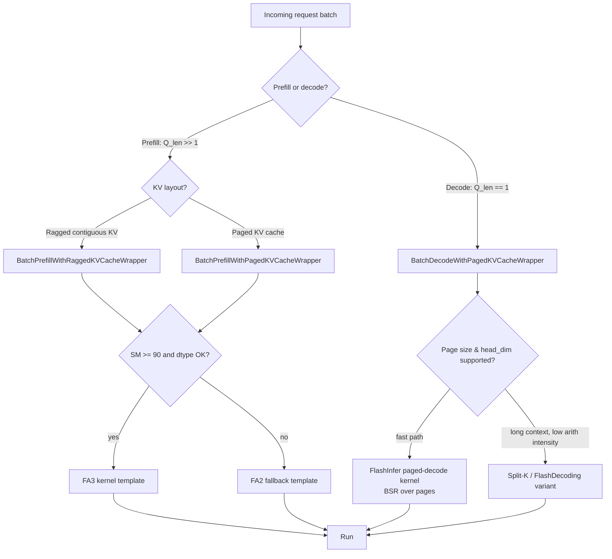

# 07 — FlashInfer: ragged batches and paged KV

> Prereq: sub-modules 01–03. Hardware: A100 ideal. T4 may work for small shapes but FlashInfer's targets are SM80+.

Production LLM serving never has a clean `(B, N, d)` tensor. You have a batch of requests with sequence lengths `[128, 4096, 512, 2048, 64, 8192, 256, 1024]`, all sharing one paged KV pool with `page_size=16` or 32 or 64. FlashInfer is the kernel library that makes attention efficient on this shape.

It won [MLSys 2025 best paper](https://www.cs.cmu.edu/news/2025/mlsys-best-paper). vLLM, SGLang, and MLC-Engine use it. NVIDIA TRT-LLM uses it for paged decode. This sub-module is how you understand what your serving stack is actually calling.

## What FlashInfer is (and what it isn't)

It is:
- A C++/CUDA kernel library with a Python wrapper that handles ragged batching, paged KV cache, custom masks, and JIT-compiled attention variants.
- A dispatcher: given the shape, dtype, mask type, and hardware, it picks the right kernel — FA2 / FA3 / FA4 / cuDNN / TRT-LLM MHA / its own templates.
- A **block-sparse-row (BSR)** abstraction over the KV cache that unifies "ragged" and "paged" into one data layout.

It isn't:
- A magic replacement for FA. The actual computation is still FA-style — FlashInfer chooses *which* FA-style kernel to call.
- A training kernel. FlashInfer is inference-focused; backward pass support is limited.

How a request lands on a backend (vLLM/SGLang-shaped dispatch on Hopper today):



Read top to bottom: the first branch (prefill vs decode) is what your serving engine decides per request; the rest is FlashInfer's `plan(...)` choosing a template based on shapes, SM version, and page geometry. The whole point is that you have one Python entry point per case and FlashInfer hides the kernel zoo behind it.

## The two layouts

### Ragged

A flat tensor of all tokens concatenated, plus an offset array (`indptr`):

```
batch = [seq_0, seq_1, seq_2, seq_3]   # lengths [128, 4096, 512, 2048]

q = torch.empty(128 + 4096 + 512 + 2048, num_heads, head_dim, dtype=bf16)  # flat
qo_indptr = torch.tensor([0, 128, 4224, 4736, 6784], dtype=torch.int32)

# seq i lives at q[qo_indptr[i]:qo_indptr[i+1]]
```

Same idea for K and V (`kv_indptr`). No padding, no wasted compute on pad tokens.

### Paged

KV cache is allocated in fixed-size pages, like OS virtual memory. Each request keeps a list of *page indices* into the pool plus the length of its last page:

```
paged_kv_cache: shape (max_num_pages, 2, page_size, num_kv_heads, head_dim)
                # [page_id, 0=K or 1=V, position_in_page, head, dim]

# request i has pages kv_page_indices[kv_page_indptr[i]:kv_page_indptr[i+1]]
# its last page has kv_last_page_len[i] valid entries

kv_page_indices = torch.tensor([3, 7, 12, 5, 8, 14, ...], dtype=torch.int32)  # global page IDs
kv_page_indptr  = torch.tensor([0, 3, 5, 9, ...], dtype=torch.int32)
kv_last_page_len = torch.tensor([16, 8, 16, 4, ...], dtype=torch.int32)
```

This is the layout vLLM invented for [PagedAttention](https://arxiv.org/abs/2309.06180). The trick: when a request is generated token by token, you append to its last page; when the last page fills, you allocate a new page from the pool. No fragmentation. No memcpy on append.

Common page sizes: 16 (vLLM default), 32, 64. Larger pages = better tensor-core friendliness but more wasted space per request.

## The FlashInfer API surface

```python
import flashinfer

# Ragged prefill.
prefill = flashinfer.BatchPrefillWithRaggedKVCacheWrapper(workspace_buffer, kv_layout="NHD")
prefill.plan(qo_indptr, kv_indptr, num_qo_heads, num_kv_heads, head_dim, causal=True)
out = prefill.run(q, k, v)

# Paged decode (one token per request).
decode = flashinfer.BatchDecodeWithPagedKVCacheWrapper(workspace_buffer, kv_layout="NHD")
decode.plan(kv_page_indptr, kv_page_indices, kv_last_page_len,
            num_qo_heads, num_kv_heads, head_dim, page_size, q_dtype=q.dtype, kv_dtype=kv_cache.dtype)
out = decode.run(q, kv_cache)
```

The pattern is **plan once, run many**. `plan(...)` computes the tile schedule, JIT-compiles the right kernel, caches everything against the metadata signature. `run(...)` is the hot path. If you skip `plan()` or call `run()` with metadata that doesn't match the planned signature, you get silent wrong outputs or shape errors.

## What you build

Three scripts.

### `ragged_prefill_demo.py`

Build a batch of 8 sequences with lengths drawn from `[64, 128, 256, 512, 1024, 2048, 4096, 8192]`. Pack them ragged. Run FlashInfer prefill. Compare to: pad-to-max + SDPA. Measure throughput.

Expected outcome on A100 at this distribution: 2–3× over padded SDPA. The win scales with the variance of the length distribution.

### `paged_decode_demo.py`

Allocate a paged KV pool with `page_size=16`, `max_num_pages=4096`. Build 32 requests with random current-context lengths from 128 to 8192. Build the `(page_indices, page_indptr, last_page_len)` triple. Run `BatchDecodeWithPagedKVCacheWrapper`. Profile with `torch.profiler` and measure:

- Cold-call JIT time (first `plan`).
- Warm-call run time.
- The ratio.

The JIT cache lives in memory (and on disk if you point `FLASHINFER_JIT_CACHE_DIR`). A real server warm-starts once, then runs hot forever.

### `vllm_dispatch_trace.py`

Spin up a small vLLM server with `VLLM_USE_V1=1`, hit it with a batch of variable-length prompts via the OpenAI-compatible API, and capture the attention dispatch path with `torch.profiler` or by reading `vllm.attention.layer` logs. Identify which FlashInfer entry point handles prefill vs decode.

This is more lab-notebook than software project. The goal: see for yourself that vLLM ends up in `flashinfer.BatchPrefillWithPagedKVCacheWrapper` for prefill on Ampere/Hopper, and `BatchDecodeWithPagedKVCacheWrapper` for decode. Write the dispatch chain down in `notes.md`.

## Why the BSR layout is clever

The thing that won FlashInfer the MLSys best paper: they noticed that **ragged and paged are the same problem in different clothing**. Both are block-sparse matrices in the KV dimension. With page_size=1, paged is ragged. With page_size=N, paged is just concatenated. Implement one block-sparse attention template; specialize it via JIT for the page size you actually have; cover both layouts plus everything in between (e.g., page_size=8 for low-latency single-user serving).

The JIT also handles the score/mask variants — causal, sliding window, custom masks (the FA4-style block-sparse mask), ALiBi via attention bias, soft-capping. Each combination is a different kernel template instantiation. FlashInfer ships ~6 templates and JIT-compiles the cross-product (~100s of unique kernels) on demand. Per-template first-call cost is ~1 second; cached subsequent calls run at peak.

## Don't make these mistakes

- **`int64` indices.** `kv_page_indices`, `kv_page_indptr`, etc. must be `int32`. `int64` gives silent indexing errors or shape mismatches.
- **Reusing a `plan()`-ed wrapper for a different shape.** The wrapper caches against the planned shape. New shape = new `plan(...)`.
- **Forgetting `kv_last_page_len`.** Without it, the kernel attends to garbage in the unused slots of the last page.
- **Mixing `kv_layout="NHD"` and `"HND"`.** They have different stride orders. Be explicit; don't accept defaults silently.

## Definition of done

- [ ] `ragged_prefill_demo.py` runs, prints throughput vs padded SDPA.
- [ ] `paged_decode_demo.py` runs, prints cold JIT time vs warm run time.
- [ ] `vllm_dispatch_trace.py` (or written notes if you can't run vLLM) — you can name the FlashInfer entry point vLLM uses for prefill vs decode on Hopper.
- [ ] `notes.md` answers: why is paged KV the right layout for a streaming server, and what's the cost?

## References

- [FlashInfer paper — arXiv 2501.01005](https://arxiv.org/abs/2501.01005), MLSys 2025 best paper.
- [FlashInfer documentation](https://docs.flashinfer.ai/) — start with the KV layout tutorial.
- [FlashInfer KV layout tutorial](https://docs.flashinfer.ai/tutorials/kv_layout.html).
- [FlashInfer GitHub](https://github.com/flashinfer-ai/flashinfer) — `csrc/flashinfer/attention/` for the kernels.
- [yadnyesh — Dissecting FlashInfer](https://ydnyshhh.github.io/posts/flash_infer/) — best third-party walkthrough.
- [NVIDIA — Run High-Performance LLM Inference Kernels Using FlashInfer](https://developer.nvidia.com/blog/run-high-performance-llm-inference-kernels-from-nvidia-using-flashinfer/).
- [PagedAttention paper — arXiv 2309.06180](https://arxiv.org/abs/2309.06180) for the layout's origin.
- [vLLM docs — paged attention design](https://docs.vllm.ai/en/stable/design/paged_attention/).
- [SGLang — attention backends](https://github.com/sgl-project/sglang/blob/main/docs/advanced_features/attention_backend.md).
