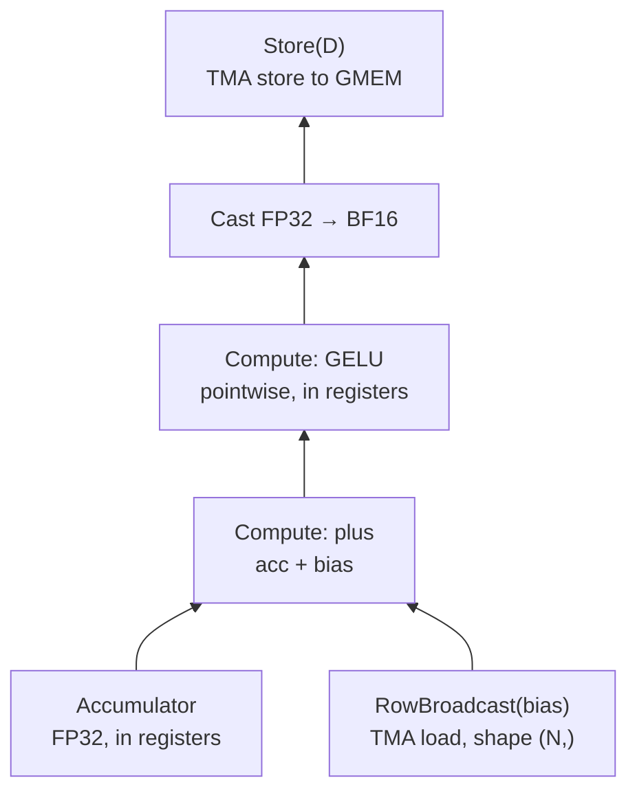

# 06 — Epilogue Visitor Trees

> Outer: [`../README.md`](../README.md) · Hardware: H100 ideal. B200 for the NVFP4 quantize epilogue.

The GEMM mainloop produces an FP32 accumulator. The epilogue decides what happens between accumulator-in-registers and bytes-in-GMEM. Without fusion, the accumulator is stored, then re-loaded by a bias-add kernel, then stored again, then re-loaded by an activation kernel — three HBM round-trips per output. Fused, the accumulator never touches HBM until it's the final result.

CUTLASS's mechanism for arbitrary epilogue fusion is the **Epilogue Visitor Tree (EVT)** — a tree of visitor nodes, each applying one operation, composed with operators like `Add`, `Compute`, `Scale`. The ASPLOS 2024 EVT paper introduced it formally; CUTLASS 3.x adopted it for SM90+; CuTe-DSL exposes it in Python.

This submodule builds two fused epilogues:

1. **Linear + bias + GELU** — the standard FFN-layer fusion. Three operations into one HBM write.
2. **Quantize to NVFP4** — the accumulator is FP32; output is FP4 with per-16-element block scales and a per-tensor scale. The epilogue computes the block max, derives scales, quantizes, packs, and stores.

## What an EVT is, structurally

A visitor tree is a small AST:

```
  Store(D)
    |
  Activation(GELU)
    |
  AddBias(bias_desc, broadcast=N)
    |
  Scale(alpha)
    |
  Accumulator
```

Each node has one input (its child's output) and one output. The tree is composed top-down (`Store` at the root). The compiler visits the tree depth-first, generating code for each node that operates on registers — no SMEM round-trip, no HBM round-trip.

CUTLASS supplies leaf nodes (`Sm90AccFetch`, `Sm90ColBroadcast`, `Sm90RowBroadcast`, `Sm90ScalarBroadcast`) and unary/binary combinators (`Sm90Compute<GELU>`, `Sm90Compute<plus>`, ...). You combine them into the tree you need.

In CuTe-DSL the same primitives are available as Python objects. The tree is built in Python, lowered through MLIR, and JIT-compiled into the kernel.

## Epilogue 1 — Linear + Bias + GELU

The standard FFN forward path:

```
out = GELU(x @ W + b)
```

The mainloop computes `acc = x @ W` in FP32. The epilogue applies `+b`, then `GELU`, then converts to BF16 for `out`.

```python
# Pseudocode for the EVT (current CuTe-DSL API may differ in names)
from cutlass.cute.epilogue import (
    AccumulatorSource, RowBroadcast, Compute, Store,
)

bias_node = RowBroadcast(bias_tma_desc, dtype=cutlass.Float32)
add_node = Compute(op="plus", lhs=AccumulatorSource(), rhs=bias_node)
gelu_node = Compute(op="gelu", input=add_node)
store_node = Store(gelu_node.to(cutlass.BFloat16), output_tma_desc)

epilogue = EpilogueVisitorTree(store_node)
```



*The EVT for `out = GELU(x @ W + b)` — every edge is register-to-register; only the leaves and the root touch memory.*

Things to notice:

- **Bias is a row broadcast.** The bias vector has shape `(N,)`; it's broadcast across the M dimension of the output tile. `RowBroadcast` issues one TMA load of the bias slice, broadcasts via the SMEM layout, and adds to the accumulator in registers.
- **GELU is pointwise in registers.** No memory traffic. The polynomial approximation lives in the IR.
- **The store is the final cast.** FP32 → BF16 is a register-side cast; the TMA store writes BF16 to GMEM.

Total HBM traffic: one A read (in mainloop), one W read (in mainloop), one bias read (in epilogue, small), one out write. Versus 3 reads + 3 writes if unfused.

[`fused_linear_bias_gelu.py`](fused_linear_bias_gelu.py) implements this fused with stage-5 from submodule 04. The benchmark in the file compares:
- Unfused: `torch.matmul` + `+bias` + `F.gelu` — separate kernels.
- `torch.compile` — Inductor's fusion attempt.
- Liger-Kernel's `fused_linear_gelu` (if you've installed Liger).
- Your CuTe-DSL EVT version.

On H100 at LLaMA-7B FFN-1 shape (`M=batch*seq, K=4096, N=11008`), the fused version should land within 10% of cuBLAS GEMM time alone — the bias and GELU come "for free."

## Epilogue 2 — Quantize to NVFP4

This is the path that lets you produce NVFP4 weights from an FP32 training accumulator. The output layout is more interesting:

```
out_quantized  : (M, N) FP4 (packed 2-per-byte)
block_scales   : (M, N/16) E8M0 (one scale per 16-element block along N)
tensor_scale   : scalar FP32 (or computed from per-block stats)
```

The epilogue logic:

1. Receive accumulator in registers, FP32.
2. For each 16-element block along N: compute `block_max = max(|acc|)`.
3. Derive E8M0 scale `s = ceil(log2(block_max / FP4_max))`.
4. Compute `quantized = round(acc / 2^s)` clamped to FP4 range.
5. Pack two FP4 values per byte.
6. Store quantized to GMEM and the scale alongside.

In EVT form:

```
  Store(D_quant)   ←  Store(S_scales)
    |                    |
  PackFP4             EmitScale
    |                    |
  Quantize ─ uses ─→ BlockMax
                       |
                    Accumulator
```

Two store roots (one for data, one for scales). The block-max computation feeds both quantization and scale emission.

The compute is non-trivial:
- `BlockMax` is a reduction over 16 consecutive N positions. It's a register-side reduction — within one warpgroup the 16-element slice typically maps to one warp's fragment.
- `Quantize` is a divide + round + clamp. Hardware on Blackwell has a `cvt.rn.satfinite.e2m1` instruction; CuTe-DSL emits it.
- `PackFP4` interleaves two 4-bit values into one byte.

[`quantize_to_nvfp4.py`](quantize_to_nvfp4.py) implements this. The file requires B200 to run the fused kernel (NVFP4 native is SM100+) but you can read the EVT structure and trace through the data flow on any machine.

Hand-fused-vs-EVT comparison: the same logic written as a separate post-GEMM kernel costs three HBM round-trips per tile (the FP32 accumulator out, the quantized data out, the scales out). EVT eliminates the first.

## When you'd write a custom epilogue node

Built-in nodes cover bias, common activations (ReLU, GeLU, SiLU, tanh), scaling, type conversion, reductions for layernorm-style epilogues, and quantization for FP8 and NVFP4. Custom nodes you might write:

- **Group-quantization with per-row scales** — for grouped GEMM in MoE.
- **Per-channel asymmetric quantization** — for INT8 with non-zero zero-point.
- **Fused softmax tail** for tiny attention shapes where you want everything in one kernel.

A custom node is a Python class (or C++ template in CUTLASS) that defines: input arity, output type, and a `visit` method that emits code given the accumulator-in-registers tensor view.

## Build steps

```bash
python fused_linear_bias_gelu.py        # H100 target
python quantize_to_nvfp4.py             # B200 target
```

Each file:
1. Defines the EVT.
2. Plugs it into the stage-5 persistent GEMM mainloop from submodule 04 (imports the kernel skeleton).
3. Runs correctness check against a torch unfused reference.
4. Benchmarks fused vs unfused vs `torch.compile`.

## References

- [Colfax: Epilogue Fusion in CUTLASS with EVT](https://research.colfax-intl.com/epilogue_visitor_tree/) — canonical tutorial.
- [EVT paper (ASPLOS '24)](https://dl.acm.org/doi/10.1145/3620666.3651369).
- [DeepWiki: Epilogue Fusion and Activation Functions](https://deepwiki.com/NVIDIA/cutlass/5.3-epilogue-fusion-and-activation-functions).
- [fal.ai: Crafting Efficient Kernels with Epilogue Fusion](https://blog.fal.ai/crafting-efficient-kernels-with-epilogue-fusion/).
- [NVIDIA: Introducing NVFP4](https://developer.nvidia.com/blog/introducing-nvfp4-for-efficient-and-accurate-low-precision-inference/).
- CUTLASS example [`49_collective_builder.cu`](https://github.com/NVIDIA/cutlass/blob/main/examples/49_hopper_gemm_with_collective_builder/49_collective_builder.cu) — EVT in CUTLASS C++.
