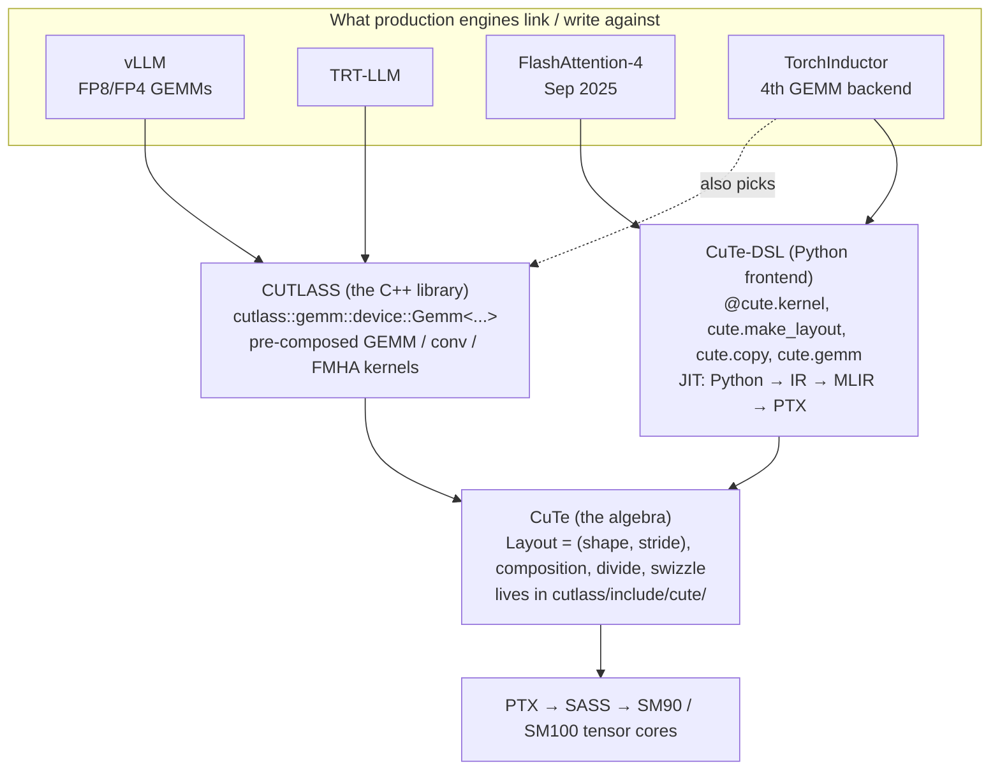

# Level 4 — CUTLASS and CuTe-DSL, the layer below Triton

> Outer reference: [`compiler-and-kernels/README.md`](../README.md)

In Level 1 you wrote Triton kernels. Triton hides a lot: the tile-to-warp mapping, the shared-memory swizzles, the WGMMA register fragment layout, the TMA descriptor packing. You wrote `tl.dot(a, b, acc)` and the compiler picked an MMA instruction; you wrote `desc.load([m, k])` and the compiler emitted the right TMA cp-async-bulk-tensor.

This level is the layer beneath that. CUTLASS is NVIDIA's open-source template library that vLLM, TRT-LLM, FlashInfer, and SGLang all link against for their FP8/FP4 GEMMs. CuTe is the algebra inside CUTLASS that describes every tensor — in HBM, in shared memory, in registers, in TMEM — as a `(shape, stride)` layout, with a small set of composition rules. CuTe-DSL is the Python frontend that NVIDIA shipped in May 2025 and stabilized through CUTLASS 4.x: same algebra, same hardware control, 20–30× faster compile than C++ templates.

The motivating fact: **FlashAttention-4 is written in CuTe-DSL.** Not Triton, not C++. The FA4 paper and the [Modal reverse-engineering writeup](https://modal.com/blog/reverse-engineer-flash-attention-4) (Sep 2025) both make the same case — Triton couldn't expose the five-warp specialization, the TMEM accumulator, the cubic-polynomial softmax, or the `tcgen05.mma.cta_group::1` 2-SM cooperative MMA that FA4 needs on Blackwell. CuTe-DSL could.

By the end of this level you can:

- Derive a CuTe layout composition with a pencil and explain why `(6,2):(8,2) ∘ 4:3 = (2,2):(24,2)`.
- Write a BF16 persistent GEMM in CuTe-DSL for Hopper (SM90) that reaches >85% of cuBLAS on H100.
- Read the FA4 Blackwell kernel — the warp roles, the TMEM dance, the `tcgen05` PTX — and follow what each piece does.
- Read vLLM's `csrc/cutlass_extensions/` C++ templates and connect every template parameter back to a concept you understand.
- Pick CuTe-DSL vs Triton vs `torch.compile` for a given workload with a defensible reason.

The capstone is a **BF16 persistent GEMM in CuTe-DSL on SM90, benchmarked head-to-head against cuBLAS and your Triton matmul from Level 1**. If your CuTe-DSL kernel beats your Triton one on TFLOPS — which it should, on large square shapes — you have proof that the extra layer of control buys real performance. If it doesn't, the post-mortem (you forgot to swizzle, you sized the cluster wrong, you didn't double-buffer SMEM) is itself a lesson.

## What you need before starting

- Levels 1–3 of this track. You know what TMA and WGMMA are *in concept*. This level makes them mechanical.
- Access to one of: A100 (SM80, fine for early submodules), H100 (SM90, ideal — the main target), B200 (SM100, for the optional TMEM modules). Submodule 02 (layout algebra) runs in pure Python with no GPU.
- A working `nvidia-cutlass-dsl` install: `pip install nvidia-cutlass-dsl` pulls the wheel that bundles `nvcc`, `ptxas`, and the MLIR-based JIT. Requires CUDA 12.4+ and Python 3.10+.
- Comfort reading CUDA-flavored C++ at the *struct-and-template* level. You will not write CUDA C++ in this level, but submodule 07 (heritage) asks you to read vLLM's CUTLASS GEMM and that requires template literacy.

## The 2026 landscape

A learner reading any pre-2025 CUTLASS material will hit two cliffs: (1) the Python-C++ bindings layer was removed in CUTLASS 4.0 in favor of CuTe-DSL; (2) Blackwell's `tcgen05` MMA family is *not* the same instruction as Hopper's WGMMA, and confusing the two leads to wrong kernels. State of the world as of May 2026:

- **CUTLASS 4.5.0** (May 6, 2026) is current. CuTe-DSL is in public beta, scheduled to graduate by summer 2026. Beta means: API can shift between minor versions; everything else (perf, correctness, hardware coverage) is production-grade — FA4 ships against the beta.
- **TorchInductor's fourth GEMM backend is CuTe-DSL** as of PyTorch 2.6 (Apr 2026). Inductor's autotuner picks between cuBLAS, CUTLASS-C++, Triton, and CuTe-DSL. On NVFP4 Blackwell GEMMs the CuTe-DSL backend sits ~5% behind hand-tuned CUTLASS C++ and ahead of Triton — see the [PyTorch blog](https://pytorch.org/blog/gemms-torchinductor-cutedsl-backend/).
- **vLLM still uses CUTLASS C++** for its production FP8/FP4 GEMM kernels (`csrc/cutlass_extensions/`). Migration to CuTe-DSL is in progress but the C++ templates remain the source of truth for what ships. You need to read both.
- **Blackwell SM100 introduced TMEM and the `tcgen05` MMA family.** TMEM is a 256 KB on-SM tensor-core-adjacent register file. The accumulator now lives in TMEM, not registers — which is why Triton can use these instructions but cannot yet express the full pipelining pattern FA4 uses. Single-thread launch (one thread issues `tcgen05.mma` on behalf of the whole CTA), CTA-pair cooperation (2-SM cooperative MMA), and the `tcgen05.ld`/`tcgen05.st` warpgroup-wide TMEM moves are all new.
- **Tile-DSL competitors exist.** Stanford Hazy Research's [ThunderKittens](https://hazyresearch.stanford.edu/blog/2024-05-12-quick-tk) (NVIDIA) and [HipKittens](https://hazyresearch.stanford.edu/blog/2025-11-09-hk) (AMD, Nov 2025) explore a higher-level tile abstraction than CuTe. They are not what production engines ship — NVIDIA's own CuTe-DSL won the de facto standardization race in 2025 — but they are useful to read for an alternative perspective on the tile-mapping problem.
- **The MLIR connection.** CuTe-DSL compiles Python → custom IR → MLIR → PTX → SASS. Level 6 of this track picks up the MLIR thread. The thing to know now: when you write `@cute.kernel` in Python, you are writing structured code that lowers through `nvgpu`, `nvvm`, and `gpu` MLIR dialects, then to `ptxas`. The compile is fast because the IR is tight and the pipeline is short.

## Mental model — three layers and where the line is

People confuse CUTLASS, CuTe, and CuTe-DSL all the time. Three layers, top down:

| Layer | What it is | What you write |
|---|---|---|
| **CUTLASS** (the library) | A C++ template library of pre-composed GEMM, conv, FMHA kernels parametrized by element type, tile shape, layout, and epilogue. The thing TRT-LLM and vLLM link against. | `cutlass::gemm::device::Gemm<...>` with 15 template params. Mostly: pick the right pre-built template. |
| **CuTe** (the algebra) | A small algebra of `(shape, stride)` layouts with composition, divide, complement, product, swizzle. Every tensor — GMEM, SMEM, registers, TMEM — is a Layout. Lives inside CUTLASS as `include/cute/`. | Layout expressions like `composition(A, B)`, `logical_divide(layout, tiler)`. |
| **CuTe-DSL** (the Python frontend) | A Python-embedded DSL that uses CuTe layouts directly. JIT-compiles to PTX via MLIR. Same algebra as C++ CuTe, but you write Python. | `@cute.kernel` functions with `cute.make_layout`, `cute.copy`, `cute.gemm`, `cute.struct`. |



*The three layers and who links against which. CuTe is the shared algebra; CUTLASS and CuTe-DSL are two frontends to it.*

The line that matters: **CUTLASS the library gives you finished GEMMs you parametrize. CuTe the algebra gives you the vocabulary to describe what's inside them. CuTe-DSL gives you the Python ergonomics to write new ones.** You use all three depending on the task.

A useful contrast: in Triton you write `BLOCK_M, BLOCK_N` and the compiler picks tile-to-warp mappings. In CuTe-DSL you write the `TiledMMA` and `TiledCopy` yourself, specifying which threads in the warp group hold which fragment of the MMA output. More control, more code, more wins on the kernels where the tile-to-warp mapping is the bottleneck.

## Topic-by-topic depth

| # | Folder | What you build | Hardware |
|---|---|---|---|
| 01 | `01-why-cutlass-exists` | A diagrammed mental-model writeup; eight diagnostic questions you should be able to answer | none |
| 02 | `02-cute-layout-algebra` | Pure-Python implementation of `(shape, stride)`, composition, coalesce, divide, swizzle, with worked examples | none / Colab CPU |
| 03 | `03-first-cutedsl-kernel` | A vector add and a transpose in CuTe-DSL. Compile, launch, verify. Get the toolchain working. | T4 / any GPU |
| 04 | `04-tma-wgmma-and-persistent-gemm` | Tiled BF16 GEMM on Hopper using TMA + WGMMA + persistent grid + warp specialization | H100 (A100 fallback) |
| 05 | `05-tmem-and-tcgen05` | Read-along walkthrough of the Blackwell TMEM accumulator pattern; hands-on if B200 available | B200 optional; otherwise annotated trace |
| 06 | `06-epilogue-visitor-trees` | Fused linear + bias + GELU epilogue, then a quantization-to-NVFP4 epilogue | H100 / B200 |
| 07 | `_capstone-bf16-persistent-gemm` | BF16 persistent GEMM in CuTe-DSL benchmarked vs cuBLAS and your Triton matmul; NVFP4 walkthrough | H100 (B200 optional) |

Submodule 02 is the no-skip foundation. Most CuTe-DSL pain comes from a vague feel for what a Layout is and how `composition` works. If you can do the worked examples in 02 with pencil and paper, every later submodule becomes mechanical. If you can't, you will fight every kernel.

## 01 — Why CUTLASS exists

CUTLASS started in 2017 as NVIDIA's response to a question: how do we ship a GEMM library that's competitive with cuBLAS but lets people specialize it for new precisions, fused epilogues, and exotic shapes? cuBLAS is a binary blob. CUTLASS is template-heavy header-only C++ — you `#include` it, instantiate `cutlass::gemm::device::Gemm<...>` with the precise tile shape and epilogue you need, and you get a kernel.

Why this matters now: every fast LLM inference engine ships a CUTLASS-based GEMM for FP8 and FP4. cuBLAS supports FP8 but it's tuned for HPC shapes (large square M=N=K). LLM serving has weird shapes — M=1 to 8 for decode, M=batch_size*seq_len for prefill, K=hidden_dim, N=vocab_size or N=intermediate_size. CUTLASS lets engines pick or generate the right kernel per shape.

The submodule walks through this story with diagrams, then asks the eight questions you should be able to answer before code:

1. Why is cuBLAS not enough?
2. What does "GEMM-shaped" mean and what fraction of LLM inference compute is GEMM-shaped?
3. What does a CUTLASS GEMM look like as a template instantiation? (you'll annotate a real one from vLLM)
4. What is the difference between CUTLASS the library and CuTe the algebra?
5. Why did NVIDIA build CuTe-DSL when ThunderKittens already existed?
6. What did Blackwell add to the kernel-author's problem? (TMEM, tcgen05, NVFP4)
7. Why is FlashAttention-4 in CuTe-DSL and not Triton?
8. When would you not reach for CUTLASS — when is Triton or `torch.compile` strictly better?

If you can answer these without notes, the rest of the level proceeds smoothly.

## 02 — CuTe layout algebra

The heart of CuTe is the `Layout`, and the heart of the Layout is one rule:

> **A Layout is a function from coordinates to integers.** Given `Layout = (shape, stride)`, the coordinate `c` maps to offset `inner_product(c, stride)`.

Everything else — composition, divide, swizzle — is built on this. We derive it bottom-up.

**Worked example 1.** A 4×8 row-major BF16 matrix. Shape `(4, 8)`, stride `(8, 1)`. Element `[2, 3]` is at offset `2*8 + 3*1 = 19`. Same matrix column-major: shape `(4, 8)`, stride `(1, 4)`. Element `[2, 3]` is at offset `2*1 + 3*4 = 14`. Same data, different layout — the layout *is* the access pattern.

**Worked example 2.** Tiling a 64×64 matrix into 16×16 blocks. The block-of-blocks layout: shape `((16, 4), (16, 4))`, stride `((1, 256), (64, 16384))`. Read this as: inside a tile, move 1 element per row, 64 per column (row-major within tile); between tiles, move 16 elements per tile-row (64*16 = 1024 in the C++ form, here written nested), 1024 per tile-column. The nesting in CuTe is structural — `(16, 4)` means "first index runs 0..15, then 0..3" — not multiplicative.

**Worked example 3 — composition.** The rule that does the work:

```
A ∘ B = R, where R(c) = A(B(c))
```

Special case (integral): `a:b ∘ s:d = s:(b*d)`. The shape comes from B; the stride multiplies. This is what lets you say "take the first 4 elements of A but stride them by 3 in A's coordinate system."

Concrete: `(6, 2):(8, 2) ∘ 4:3`. Apply distributivity through B's modes, then the integral rule. The result is `(2, 2):(24, 2)` — a 4-element layout where the first 2 step by 24 in memory, the next 2 step by 2.

**Worked example 4 — coalesce.** Layouts with size-1 modes or adjacent contiguous modes can be simplified without changing the function. `(2, 1, 6):(1, 6, 2)` coalesces to `12:1` (the size-1 mode disappears; the remaining modes are contiguous so they merge). You use coalesce constantly to keep layout expressions readable.

**Worked example 5 — divide and tile.** `logical_divide(A, B)` splits A into "the elements selected by B" and "the rest." If `A = 24:1` (a 24-element flat array) and `B = 4:1` (a tile of 4 contiguous elements), then `A ÷ B = ((4:1), (6:4))` — mode 0 is the tile, mode 1 indexes the 6 tiles. This is exactly the operation that turns a 64×64 matrix into a `(num_tiles_M, num_tiles_N)` grid of `(BLOCK_M, BLOCK_N)` tiles.

**Worked example 6 — swizzle.** Shared memory has 32 banks; two threads accessing the same bank serialize. CuTe's `Swizzle<BBits, MBase, SShift>` applies an XOR-based permutation to addresses so a 16-wide tile of bf16 (the natural WGMMA fragment) doesn't bank-conflict. The canonical patterns are `Swizzle<0,4,3>` (none), `<1,4,3>` (32B), `<2,4,3>` (64B), `<3,4,3>` (128B). Most BF16/FP16 GEMMs use 128B swizzle for the SMEM staging buffer.

The folder contains a Python module `cute_algebra.py` that implements Layout, composition, coalesce, divide, and a tiny swizzle, with the worked examples above as `pytest` cases. You run them, change inputs, verify outputs match the formulas. No GPU needed.

References: the [CuTe Layout Algebra docs](https://docs.nvidia.com/cutlass/latest/media/docs/cpp/cute/02_layout_algebra.html), Cris Cecka's [CuTe Layout Representation and Algebra preprint](https://arxiv.org/abs/2603.02298), and Jay Shah's "[A note on the algebra of CuTe Layouts](https://leimao.github.io/downloads/article/2024-10-20-CuTe-Layout-Algebra/layout_algebra.pdf)" are the canonical sources. Colfax's [Categorical Foundations for CuTe Layouts](https://research.colfax-intl.com/categorical-foundations-for-cute-layouts/) is the math-heavy version if you want it.

## 03 — Your first CuTe-DSL kernel

Get the toolchain working. Three small kernels:

1. **Hello-from-GPU.** `@cute.kernel def f(): cute.printf(...)`. Verifies your install.
2. **Vector add.** `c = a + b`, elementwise. Introduces tensors-as-DLPack-PyTorch-views, `cute.make_tensor`, `cute.copy`, and the `@cute.kernel` / `@cute.jit` boundary.
3. **Transpose with swizzle.** A 64×64 matrix transpose using a swizzled shared-memory layout. This is the first place SMEM bank conflicts matter; you measure with and without swizzle and watch shared-mem throughput change by 4×.

The `@cute.kernel` / `@cute.jit` rule (worth memorizing on day one):

- `@cute.jit` decorates host-side functions that allocate, launch, and synchronize. Called from Python.
- `@cute.kernel` decorates the device function — the GPU code. Cannot be called directly from Python; only from a `@cute.jit` function via `.launch(grid=..., block=...)`.
- Inside `@cute.kernel`, Python control flow (`if`, `for`) is rewritten to IR by the preprocessor. You write Python; you get specialized PTX.

Tensors cross the boundary via DLPack: you pass a `torch.Tensor` to the `@jit` function and CuTe-DSL converts it to a `cute.Tensor` view automatically. No copies.

## 04 — TMA, WGMMA, and the persistent BF16 GEMM on SM90

This is the level's hands-on centerpiece. You build a persistent BF16 GEMM on Hopper, step by step, ending at >85% of cuBLAS.

Five stages, each its own file:

1. **Naive tiled GEMM.** No TMA, no warp specialization. Plain `cute.copy` from GMEM to SMEM, `cute.gemm` with the `SM90_64x128x16_F32BF16BF16_SS` MMA atom. Measure: ~30% of cuBLAS. Bottleneck: the consumer warps stall on the GMEM→SMEM copies.
2. **+ TMA.** Replace the `cute.copy` with a TMA descriptor and `cp.async.bulk.tensor`. The descriptor encodes shape, stride, swizzle, and box size; one instruction per tile, no warp participation. Measure: ~55%. Bottleneck: still serializing memory and compute.
3. **+ Multi-stage SMEM pipeline.** Allocate 3-stage SMEM buffers; while consumers compute on tile *k*, producers TMA-load tile *k+1*. This is the async pipeline pattern. Measure: ~70%.
4. **+ Warp specialization.** Split the CTA into producer warps (TMA-only) and consumer warpgroups (WGMMA-only). The producer/consumer ping-pong runs at full overlap. The barriers (`mbarrier`) coordinate. Measure: ~80%.
5. **+ Persistent grid.** Launch `grid = (num_SMs,)` instead of `(M/BLOCK_M, N/BLOCK_N)`. Each persistent CTA loops over multiple output tiles internally, picking the next via an atomic counter or precomputed schedule. CUDA-graph compatible. Measure: ~85–90%.

This is the same shape of progression as Level 1's RMSNorm bandwidth journey, applied to GEMM instead of elementwise+reduction. Same lesson, different op.

The canonical reference is the [`hopper/dense_gemm_persistent.py`](https://github.com/NVIDIA/cutlass/blob/main/examples/python/CuTeDSL/hopper/dense_gemm_persistent.py) example in the CUTLASS repo. Open it side-by-side as you build. The Colfax [Hopper WGMMA tutorial](https://research.colfax-intl.com/cutlass-tutorial-wgmma-hopper/) and the [Hopper TMA tutorial](https://research.colfax-intl.com/tutorial-hopper-tma/) cover the same material in C++; the algebra and the patterns are identical to the Python.

**Hardware note.** Submodule 04 is the only place an A100 is meaningfully worse than an H100. A100 has no TMA and no WGMMA — you get up to stage 3 (multi-stage pipelining with `cp.async`) and stop. Run the rest on H100, or read the included trace.

## 05 — TMEM and tcgen05 on Blackwell

This submodule is read-only unless you have a B200. Even if you don't, you should walk through it carefully — FA4 lives here, and the next two years of NVIDIA kernel work will too.

The Blackwell tensor-core shape changed three things that matter for kernel authors:

1. **Accumulators live in TMEM, not registers.** TMEM is a 256 KB on-SM 2D register file (128 lanes × 512 columns of 32-bit cells). The address is `(lane_id << 16) | column`. Allocation is column-granular and explicit: `tcgen05.alloc`, `tcgen05.dealloc`. The MMA result writes to TMEM; you then explicitly `tcgen05.ld` it into registers for the epilogue.
2. **MMA is issued by a single thread on behalf of the CTA.** WGMMA was issued by a full warpgroup (128 threads). `tcgen05.mma` is issued by *one thread* and operates on TMEM accumulators. This simplifies the kernel structure — no warp-group-wide barrier needed at the issue site — but means TMEM moves *out* still require a warpgroup (`tcgen05.ld` is warpgroup-wide; one warp can only see 32 of the 128 TMEM lanes).
3. **2-SM cooperative MMA.** A pair of CTAs in the same cluster can cooperatively execute one MMA tile. Each loads half the operand, holds half the accumulator. The leader CTA issues the `tcgen05.mma.cta_group::2` instruction. This is how Blackwell hits its peak BF16/FP8/FP4 numbers — single-SM MMA can't saturate the tensor cores at the new tile sizes.

The submodule provides annotated walkthroughs of three files:

- [`cutlass/examples/cute/tutorial/blackwell/01_mma_sm100.cu`](https://github.com/NVIDIA/cutlass/blob/main/examples/cute/tutorial/blackwell/01_mma_sm100.cu) — minimal single-SM `tcgen05.mma` example. Annotated to point out the TMEM allocate/dealloc, the address layout, the `tcgen05.ld` move.
- [`cutlass/examples/cute/tutorial/blackwell/04_mma_tma_2sm_sm100.cu`](https://github.com/NVIDIA/cutlass/blob/main/examples/cute/tutorial/blackwell/04_mma_tma_2sm_sm100.cu) — the 2-SM cooperative pattern. Annotated to show CTA-pair coordination, leader/peer roles.
- `cutlass/examples/python/CuTeDSL/blackwell/dense_gemm_persistent.py` — the Python equivalent of submodule 04 but targeting SM100. Annotated to show what changes when you go from WGMMA to `tcgen05.mma`.

Optional hands-on (B200 only): port your SM90 GEMM from submodule 04 to SM100. Most of the kernel structure carries; the TMEM management and the MMA atom swap.

The canonical learning sources here are [Colfax: Writing GEMM Kernels Using Tensor Memory](https://research.colfax-intl.com/cutlass-tutorial-writing-gemm-kernels-using-tensor-memory-for-nvidia-blackwell-gpus/), [Colfax: Thread Block Clusters on Blackwell](https://research.colfax-intl.com/cutlass-tutorial-gemm-with-thread-block-clusters-on-nvidia-blackwell-gpus/), and gau-nernst's [tcgen05 for dummies](https://gau-nernst.github.io/tcgen05/) (the clearest plain-CUDA writeup that reaches 98% of cuBLAS at M=N=K=4096).

## 06 — Epilogue Visitor Trees

After the GEMM produces an accumulator tile, the epilogue applies post-processing: bias add, activation, scaling, quantization. Without fusion, each is a separate kernel and a separate HBM round-trip. With fusion, the accumulator is consumed in registers (Hopper) or TMEM (Blackwell), transformed, and written once.

CUTLASS's mechanism is the **Epilogue Visitor Tree (EVT)** — a composable tree of visitor nodes, each applying one operation. The ASPLOS 2024 paper introduced EVT formally; CUTLASS 3.x adopted it for SM90+; CuTe-DSL exposes it in Python.

You build two epilogues:

1. **Linear + bias + GELU.** The standard FFN-layer-1 fusion. Bias is a separate TMA descriptor (vector, broadcast across M); GELU is a pointwise op in registers; output writes one HBM transaction per tile.
2. **Quantize to NVFP4.** The accumulator is FP32; output is FP4 with per-16-element E4M3 block scales plus a per-tensor FP32 scale. The epilogue computes the block max, derives the scale, divides, packs to FP4, and writes. This is the path that lets you run FP4 inference end-to-end.

References: [Colfax: Epilogue Visitor Trees](https://research.colfax-intl.com/epilogue_visitor_tree/) and the [EVT ASPLOS paper](https://dl.acm.org/doi/10.1145/3620666.3651369).

## Capstone — BF16 persistent GEMM in CuTe-DSL on SM90

The capstone in [`_capstone-bf16-persistent-gemm/`](_capstone-bf16-persistent-gemm/) is structured as:

1. Take your stage-5 persistent GEMM from submodule 04. This is the starting point. Clean it up: docstrings, comments on every layout, a small `pytest` correctness suite against `torch.matmul`.
2. Tune for one specific hardware. Pick H100 or A100; declare the target in the header. Sweep `BLOCK_M ∈ {64, 128, 256}`, `BLOCK_N ∈ {128, 256}`, `BLOCK_K ∈ {64, 128}`, `num_stages ∈ {2, 3, 4}`, cluster shape `∈ {(1,1), (2,1), (2,2)}`. Pruning is mandatory — many configs are illegal on register-pressure or SMEM grounds. Write the pruning function.
3. Benchmark on a grid of shapes: `M ∈ {512, 1024, 2048, 4096, 8192}`, `N = K = M` (square) and `M=batch*seq=8192, K=4096, N=12288` (LLaMA-7B FFN-1 shape). For each shape, measure cuBLAS, your Triton matmul from Level 1, and your CuTe-DSL kernel. Report TFLOPS and percent-of-cuBLAS.
4. Write a one-page report. Where you matched cuBLAS, where you fell short, what each tuning knob bought, what surprised you. If you exceeded cuBLAS on any shape, double-check (warmup, dtype, shape, did you launch?) before claiming the win.
5. **NVFP4 walkthrough.** Open `examples/python/CuTeDSL/blackwell/dense_blockscaled_gemm_persistent.py`. Annotate every novel line vs your SM90 BF16 kernel. Submit the annotated file. If you have B200 access, run it and add a row to the benchmark table.

The benchmark table you produce:

| Kernel | Shape (M,N,K) | dtype | TFLOPS | % cuBLAS | Notes |
|---|---|---|---|---|---|
| cuBLAS | 4096³ | BF16 | | 100% | reference |
| Your Triton (Level 1) | 4096³ | BF16 | | | |
| Your CuTe-DSL, naive | 4096³ | BF16 | | | submodule 04 stage 1 |
| Your CuTe-DSL, + TMA | 4096³ | BF16 | | | stage 2 |
| Your CuTe-DSL, + multi-stage | 4096³ | BF16 | | | stage 3 |
| Your CuTe-DSL, + warp spec | 4096³ | BF16 | | | stage 4 |
| Your CuTe-DSL, persistent (final) | 4096³ | BF16 | | | stage 5 |
| Your CuTe-DSL, persistent (final) | LLaMA FFN-1 | BF16 | | | |
| cuBLAS | 4096³ | NVFP4 | | 100% | B200 only |
| `dense_blockscaled_gemm_persistent.py` | 4096³ | NVFP4 | | | B200 only |

Bar for done: **stage-5 within 15% of cuBLAS on a square 4096³ on H100**, with the report explaining the remaining gap.

## Definition of done

- [ ] You can derive `(6,2):(8,2) ∘ 4:3 = (2,2):(24,2)` on paper without notes.
- [ ] Your `cute_algebra.py` Python implementation matches the CuTe rules on the worked examples.
- [ ] You have a vector add and a swizzled transpose in CuTe-DSL that compile and run.
- [ ] You walked the five-stage Hopper persistent GEMM build — even if you only had A100 for stages 1–3.
- [ ] You read the three Blackwell annotated walkthroughs and can explain why `tcgen05.mma` is issued by one thread.
- [ ] You wrote a fused linear+bias+GELU epilogue and verified it against an unfused PyTorch reference.
- [ ] Capstone: stage-5 CuTe-DSL persistent GEMM within 15% of cuBLAS on 4096³ BF16 on your hardware, with a written report.

## Common pitfalls

These eat people. Note them as you hit them.

1. **You wrote a `@cute.kernel` and called it from Python directly.** Error: `@cute.kernel` can only be called from `@cute.jit`. Wrap the launch in a `@cute.jit` function.
2. **You forgot to deallocate TMEM on Blackwell.** Kernel hangs the next launch. Always `tcgen05.dealloc` before kernel exit; in CuTe-DSL this is automatic if you use the allocator helpers, manual if you go through inline PTX.
3. **You swizzled SMEM but not the descriptor.** The MMA atom expects swizzled SMEM in the documented pattern; if your TMA descriptor's swizzle doesn't match the MMA's expectation, you get wrong numbers, fast. Use the canonical pair from the example files.
4. **You compared kernels on different SM counts.** A persistent kernel launched on H100 PCIe (114 SMs) vs H100 SXM (132 SMs) reports different TFLOPS for the same code. State the exact hardware.
5. **You autotuned without pruning.** A square `BLOCK_M=BLOCK_N=256` with `num_stages=4` blows SMEM. The sweep takes hours and most configs OOM. Write the pruning function on day one.
6. **You measured before warmup.** First CuTe-DSL launch JIT-compiles. Burn 5 warmup launches before timing.
7. **You confused WGMMA and `tcgen05.mma`.** They are different instructions with different launch semantics. The Hopper kernel uses one; the Blackwell kernel uses the other. Don't port a Hopper kernel to SM100 by changing the arch tag and expect it to work.
8. **You read pre-2025 CUTLASS material.** The Python-C++ binding layer is gone. CuTe-DSL is the Python path. If a tutorial uses `cutlass.cute.gemm.GemmCoord` from the old bindings, it's stale.

## Resources

Current set, 2024–2026, in roughly the order to read.

**Foundational.**
- [Achieve CUTLASS C++ Performance with Python APIs Using CuTe DSL](https://developer.nvidia.com/blog/achieve-cutlass-c-performance-with-python-apis-using-cute-dsl/) — NVIDIA's introduction.
- [CuTe DSL — NVIDIA CUTLASS Documentation](https://docs.nvidia.com/cutlass/latest/media/docs/pythonDSL/cute_dsl.html) — the canonical reference.
- [Ian Barber — Cute-DSL](https://ianbarber.blog/2025/07/04/cute-dsl/) (Jul 2025) — the best short blog intro.
- [Ian Barber — Quack CuteDSL Kernels](https://ianbarber.blog/2025/07/18/quack-cutedsl-kernels/) (Jul 2025) — follow-on with real kernels.
- [Cris Cecka — CuTe Layout Representation and Algebra](https://arxiv.org/abs/2603.02298) — the paper. Read after you've done the worked examples.
- [Jay Shah — A note on the algebra of CuTe Layouts](https://leimao.github.io/downloads/article/2024-10-20-CuTe-Layout-Algebra/layout_algebra.pdf) — clearer than the docs in places.

**Colfax CUTLASS tutorials.** Read in this order:
- [GEMM kernel design and pipelining](https://research.colfax-intl.com/cutlass-tutorial-design-of-a-gemm-kernel/)
- [Hopper TMA](https://research.colfax-intl.com/tutorial-hopper-tma/)
- [Hopper WGMMA](https://research.colfax-intl.com/cutlass-tutorial-wgmma-hopper/)
- [Epilogue Visitor Trees](https://research.colfax-intl.com/epilogue_visitor_tree/)
- [Blackwell: GEMM with thread block clusters](https://research.colfax-intl.com/cutlass-tutorial-gemm-with-thread-block-clusters-on-nvidia-blackwell-gpus/)
- [Blackwell: Writing GEMM with Tensor Memory](https://research.colfax-intl.com/cutlass-tutorial-writing-gemm-kernels-using-tensor-memory-for-nvidia-blackwell-gpus/)
- [Blackwell: Hardware-supported block scaling](https://research.colfax-intl.com/cutlass-tutorial-hardware-supported-block-scaling-with-nvidia-blackwell-gpus/)
- [Blackwell: Sub-byte GEMM](https://research.colfax-intl.com/cutlass-tutorial-sub-byte-gemm-on-nvidia-blackwell-gpus/)
- [Categorical Foundations for CuTe Layouts](https://research.colfax-intl.com/categorical-foundations-for-cute-layouts/) — optional math depth.

**Blackwell deep reads.**
- [gau-nernst — tcgen05 for dummies](https://gau-nernst.github.io/tcgen05/) — plain CUDA, reaches 98% of cuBLAS, the clearest single explanation.
- [SemiAnalysis — Dissecting Nvidia Blackwell](https://newsletter.semianalysis.com/p/dissecting-nvidia-blackwell-tensor) — what the hardware actually is.
- [SemiAnalysis — Tensor Core Evolution: Volta to Blackwell](https://newsletter.semianalysis.com/p/nvidia-tensor-core-evolution-from-volta-to-blackwell).
- [Microbenchmarking Blackwell](https://arxiv.org/html/2512.02189v1) (Dec 2025) — measured numbers.

**FlashAttention-4 and CuTe-DSL in production.**
- [Modal — We reverse-engineered Flash Attention 4](https://modal.com/blog/reverse-engineer-flash-attention-4) (Sep 2025) — the writeup.
- [FA4 paper — arXiv 2603.05451](https://arxiv.org/abs/2603.05451).
- [Together AI — FlashAttention-4](https://www.together.ai/blog/flashattention-4).
- [PyTorch — FlexAttention + FlashAttention-4: Fast and Flexible](https://pytorch.org/blog/flexattention-flashattention-4-fast-and-flexible/).
- [PyTorch — Generating SOTA GEMMs with TorchInductor's CuTeDSL backend](https://pytorch.org/blog/gemms-torchinductor-cutedsl-backend/) (Apr 2026).

**Numerics — NVFP4 and MXFP8.**
- [NVIDIA — Introducing NVFP4 for Efficient and Accurate Low-Precision Inference](https://developer.nvidia.com/blog/introducing-nvfp4-for-efficient-and-accurate-low-precision-inference/).
- [PyTorch — Faster Diffusion on Blackwell: MXFP8 and NVFP4](https://pytorch.org/blog/faster-diffusion-on-blackwell-mxfp8-and-nvfp4-with-diffusers-and-torchao/).
- [Edge AI — NVFP4 for LLM Inference](https://www.edge-ai-vision.com/2025/10/nvidia-blackwell-the-impact-of-nvfp4-for-llm-inference/).

**Tile-DSL alternatives (for context, not to use).**
- [ThunderKittens](https://hazyresearch.stanford.edu/blog/2024-05-12-quick-tk) — Hazy Research's tile DSL.
- [HipKittens](https://hazyresearch.stanford.edu/blog/2025-11-09-hk) (Nov 2025) — AMD port; the architectural-portability argument.

**Source to read.**
- [CUTLASS examples/python/CuTeDSL/](https://github.com/NVIDIA/cutlass/tree/main/examples/python/CuTeDSL) — the in-tree Python examples. Start with `hopper/dense_gemm_persistent.py`.
- [vLLM csrc/cutlass_extensions/](https://github.com/vllm-project/vllm/tree/main/csrc/cutlass_extensions) — production CUTLASS C++ in vLLM.
- [DeepGEMM](https://github.com/deepseek-ai/DeepGEMM) — DeepSeek's clean FP8 GEMM kernels, CuTe-based.

## What you can do after this level

You can read FA4's kernel and follow it. You can open `csrc/cutlass_extensions/` in vLLM and tell which template parameter controls the tile shape and which controls the cluster size. You can write a custom NVFP4 GEMM for a shape cuBLAS doesn't tune well and benchmark it. You can pick the right tool for a new fused op: Triton if the bottleneck is bandwidth and tile shape is flexible, CuTe-DSL if you need WGMMA/tcgen05 control or non-standard quantization, `torch.compile` if the op is something Inductor already covers.

You are not yet someone who has merged a CuTe-DSL PR into CUTLASS — that takes more time and a specific motivating problem. You are someone who could.
