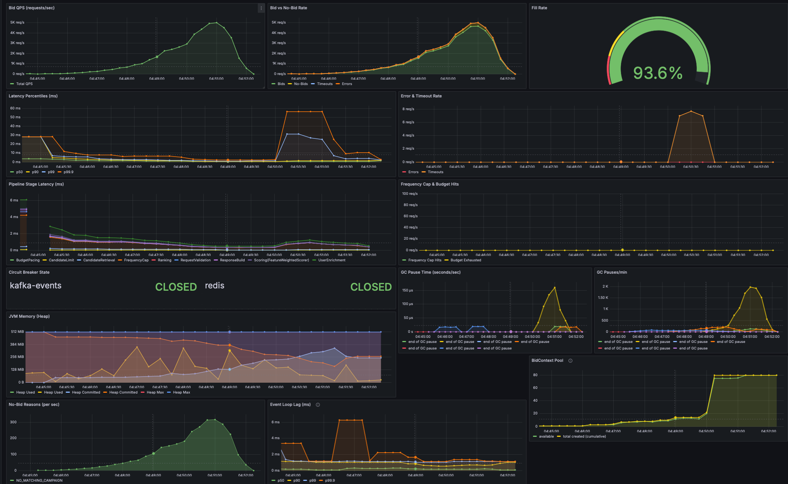
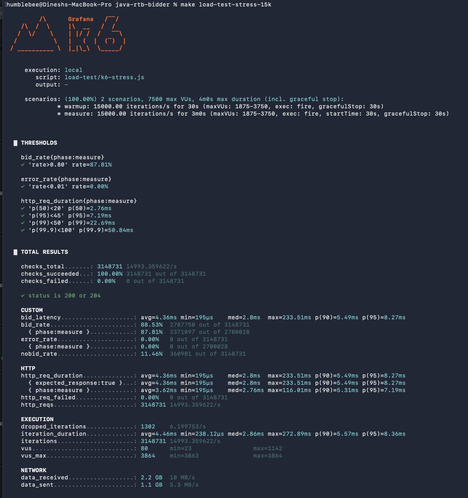

# RTB Bidder

Real-Time Bidding engine in Java 21. Accepts OpenRTB-style bid requests, runs them through an 8-stage pipeline (segment targeting → freq-cap → scoring → ranking → budget → response), and returns a bid within a 50 ms SLA.

## What RTB is

Every time a webpage or app loads an ad slot, an auction runs in the time it takes the page to render — typically under 100 ms end-to-end. The publisher (or its supply-side platform) broadcasts a bid request to dozens of demand-side platforms (DSPs); each one decides whether the user is a fit for any of its advertisers' campaigns and returns a price. The highest bidder's ad is shown.

A DSP bidder has milliseconds, not seconds, to:
- Look up who the user is (audience segments, frequency history)
- Match the request against potentially thousands of campaign targeting rules
- Score the matches (relevance, expected click-through, business value)
- Honour budget pacing and frequency caps
- Return a price

Miss the deadline and the auction proceeds without you. This project is a working DSP bidder built around that constraint — every architectural choice is in service of staying under the 50 ms p99 budget at sustained throughput.

Single-instance throughput on an M-class MacBook Pro: **~15K RPS SLA-bound** at p99 < 50 ms with 1M users, 1000-campaign realistic catalog, full Postgres + Redis stack co-located on the same machine.

## Performance

Validated on the workload: 1M synthetic users, 1000 campaigns from Postgres, 50 ms p99 SLA, 30 s warmup + 3 min measure window per rate.

| RPS | p50 | p95 | p99 | p99.9 | bid_rate | SLA |
|---|---|---|---|---|---|---|
| 5K | 770 µs | 1.22 ms | 1.91 ms | 3.31 ms | 99.80% | ✓ |
| 10K | 1.74 ms | 3.58 ms | 5.35 ms | 13.68 ms | 95.07% | ✓ |
| 15K | 2.76 ms | 7.19 ms | 22.69 ms | 50.84 ms | 87.81% | ✓ |
| 20K | 3.68 ms | 50.20 ms | 52.47 ms | 54.74 ms | 77.18% | p99 2.5 ms over |
| 25K | 51 ms | 53 ms | 58 ms | 72.31 ms | 16.46% | rig-bound (k6 + bidder + Docker on 12 cores) |

> **Note on bid_rate at higher rates:** the bidder enforces a strict 50 ms per-request deadline — any pipeline stage that exceeds the budget aborts with a no-bid (`TIMEOUT`). Relaxing this contract (e.g. raising `PIPELINE_SLA_MAXLATENCYMS` to 100 ms) would convert most TIMEOUT no-bids into served bids, raising the headline bid_rate at 20K+. The numbers above reflect the tightest possible deadline; loosening it is a deliberate engineering choice between latency guarantees and bid coverage.

Full per-run breakdowns + JFR analyses: [docs/LOAD-TEST-RESULTS-v4.md](docs/LOAD-TEST-RESULTS-v4.md), [v5.1](docs/LOAD-TEST-RESULTS-v5.1.md), [v5.2](docs/LOAD-TEST-RESULTS-v5.2.md). Investigation diary: [docs/analysis/investigation-log.md](docs/analysis/investigation-log.md).

## Architecture

```
                            ┌──────────────────────────────────┐
                            │  Vert.x HTTP server (event loop) │
                            └──────────────┬───────────────────┘
                                           │ executeBlocking → worker pool
                            ┌──────────────▼───────────────────┐
                            │           Bid Pipeline           │
                            │                                  │
                            │  1. RequestValidation            │
                            │  2. UserEnrichment ──────────────┼─→ Redis SMEMBERS (Caffeine cached)
                            │  3. CandidateRetrieval           │   ↳ bitmap segment AND
                            │  4. CandidateLimit (top-K heap)  │
                            │  5. Scoring                      │
                            │  6. FrequencyCap (paged MGET) ───┼─→ Redis or Aerospike
                            │  7. Ranking                      │
                            │  8. BudgetPacing                 │
                            │  9. ResponseBuild                │
                            └──────────────┬───────────────────┘
                                           │
                                           ├─→ HTTP response (≤50ms)
                                           │
                                           └─→ ImpressionRecorder (bounded queue, 2 workers)
                                                ↳ async EVAL increments freq counters
```

**Key architectural choices** (full rationale in [docs/ARCHITECTURE.md](docs/ARCHITECTURE.md)):

| Layer | Implementation | Why |
|---|---|---|
| HTTP | Vert.x on Netty, event-loop + worker pool | Non-blocking I/O; thousands of concurrent connections on a few threads |
| Hot-path Redis | Lettuce async, round-robin connection array (4 read + 4 write) | Distributes decode work across N nioEventLoop threads without pool-borrow lock contention |
| Segment matching | 64-bit bitmap AND (registry assigns each segment a bit position) | One AND instruction per campaign vs N hash lookups |
| Top-K candidates | Bounded `PriorityQueue` of size K | O(N log K) instead of O(N log N) full sort |
| Frequency-cap store | Pluggable: Redis (default) or Aerospike | `FREQCAP_STORE` flag in `.env`; Aerospike container only starts when selected |
| Post-response writes | `ImpressionRecorder`: bounded `ArrayBlockingQueue` + dedicated workers | Backpressure; drops on saturation rather than blocking the bid response |
| Campaign loading | Postgres at startup → in-memory `AtomicReference` | Postgres never on hot path |
| User segments | Redis Sets, Caffeine W-TinyLFU cache (500K entries, 60s TTL) | Cache catches the temporal-locality fraction; cold misses fall back to Redis |
| GC | ZGC, generational, 2 GB heap | Sub-ms pauses at sustained 5K-15K RPS allocation rate |
| Events | Kafka async producer (or `noop`) | Fire-and-forget; never blocks bid path |

## Tech Stack

| Layer | Component | Purpose |
|---|---|---|
| Language / runtime | Java 21, ZGC | Sub-ms GC pauses at sustained allocation rate |
| HTTP | Vert.x 4 (on Netty) | Non-blocking HTTP server, event-loop + worker pool |
| Redis client | Lettuce 6 (async) | User segments + freq-cap reads/writes |
| Aerospike client | Aerospike Java client 10 (async, optional) | Alternative freq-cap store for high-RPS deployments |
| Campaigns | PostgreSQL 16 | Campaign catalog (loaded into memory at startup) |
| Events | Kafka 3.7 (or noop) | Async bid/win/click event stream |
| Analytics sink | ClickHouse 24 | OLAP queries over the event stream |
| Metrics | Micrometer → Prometheus | Application + JVM metrics |
| Dashboards | Grafana 11 | Live latency / throughput / bid-rate panels |
| Container metrics | cAdvisor | Per-container CPU / memory for Prometheus |
| ML inference | ONNX Runtime (XGBoost pCTR model) | Optional pCTR scorer (cascade or pure-ml mode) |
| Load testing | k6 | Constant-arrival-rate stress tests |
| Profiling | JFR + JMC | Continuous CPU / allocation / GC profiling |
| Container runtime | Docker + Docker Compose | Local infra orchestration (Redis, Postgres, Kafka, ClickHouse, Aerospike, observability stack) |

## Project layout

```
src/main/java/com/rtb/
  Application.java               composition root (manual DI)
  server/                        Vert.x setup, request handlers
  pipeline/                      BidPipeline + BidContext + 9 stages
  pipeline/stages/               request validation, enrichment, candidate retrieval/limit,
                                 scoring, freq-cap, ranking, budget pacing, response build
  targeting/                     SegmentTargetingEngine, EmbeddingTargetingEngine,
                                 SegmentBitmap (registry + 64-bit encoding)
  scoring/                       FeatureWeightedScorer, MLScorer, CascadeScorer, ABTestScorer
  frequency/                     FrequencyCapper interface, RedisFrequencyCapper,
                                 AerospikeFrequencyCapper
  pacing/                        BudgetPacer interface + Local / Distributed / HourlyPaced /
                                 QualityThrottled implementations
  repository/                    CampaignRepository (Postgres + cached), UserSegmentRepository
                                 (Redis + Caffeine cached)
  resilience/                    CircuitBreaker, ResilientRedis, ResilientEventPublisher
  event/                         EventPublisher (Kafka, NoOp)
  metrics/, health/, codec/, config/, model/

docs/                            ARCHITECTURE.md, GUIDE.md, LOAD-TEST-RESULTS-v*.md,
                                 analysis/investigation-log.md, perf_ideas/, notes/
docker/                          init-postgres.sql, seed-redis.py, prometheus.yml,
                                 grafana/ provisioning + dashboards
load-test/                       k6 scripts (baseline, ramp, spike, stress, helpers)
ml/                              feature_schema.json, train_pctr_model.py, embeddings
results/                         JFR dumps, k6 summary JSON, screenshots
```

## Quick start

```bash
# 1. Start infra (Redis, Postgres, Kafka, Prometheus, Grafana, ClickHouse, exporters)
make setup           # one-time: starts containers + seeds 1M users into Redis
make infra-up        # start docker containers containers

# 2. Build and run the bidder
make run-prod-load   # production JVM flags (ZGC, 2g heap, JFR continuous), reads .env

# 3. In another terminal — verify
make health          # GET /health
make bid             # sample bid request
make load-test-stress-5k     # 5K RPS, 30s warmup + 3min measure, k6 summary saved

# Common Makefile targets
make help            # full list
make jfr-dump        # snapshot the current JFR recording
make reset-state     # wipe freq counters in whichever stores are running
make infra-down      # stop and remove all containers
```

## Configuration

All runtime config is in `.env.dev` (committed, no secrets). Copy to `.env` for local overrides. Resolution order: env var → `.env`/`.env.dev` → `application.properties` → hardcoded default.

Common knobs (full list in `.env.example`):

| Variable | Default | Purpose |
|---|---|---|
| `SERVER_PORT` | 8080 | HTTP port |
| `PIPELINE_SLA_MAXLATENCYMS` | 50 | Per-request deadline |
| `PIPELINE_CANDIDATES_MAX` | 32 | Top-K cap before scoring |
| `PIPELINE_FREQUENCYCAP_BATCHSIZE` | 16 | Score-ordered MGET page size |
| `PIPELINE_FREQUENCYCAP_KEEPTOPALLOWED` | 64 | Stop after this many pass freq cap |
| `CAMPAIGNS_SOURCE` | json / postgres | Catalog source |
| `EVENTS_TYPE` | noop / kafka | Event publisher |
| `FREQCAP_STORE` | redis / aerospike | Freq-cap backend |
| `SCORING_TYPE` | feature-weighted / ml / cascade / abtest | Scorer |
| `REDIS_POOL_SIZE` | 4 | Lettuce connections per Redis client |

## Documentation

| Topic | File |
|---|---|
| Architecture deep-dive (modules, flow, decisions) | [docs/ARCHITECTURE.md](docs/ARCHITECTURE.md) |
| Operations: setup, run, test, troubleshoot | [docs/GUIDE.md](docs/GUIDE.md) |
| Load test results — Check each Run results | [docs/LOAD-TEST-RESULTS-v4.md](docs/LOAD-TEST-RESULTS-v4.md) |
| Future experiment plan | [docs/perf_ideas/v5-experiment-plan.md](docs/perf_ideas/v5-experiment-plan.md) |

## Endpoints

| Method | Path | Purpose |
|---|---|---|
| `POST` | `/bid` | Submit OpenRTB-style bid request, returns bid response or 204 no-bid |
| `GET`  | `/health` | Liveness; aggregates Redis + Kafka health checks |
| `GET`  | `/metrics` | Prometheus scrape endpoint |
| `GET`  | `/win` | Win notification handler |
| `GET`  | `/click`, `/pixel` | Tracking handlers |

## Run Analysis Snapshots

<table>
<tr>
<td colspan="2" align="center">

<br><sub>k6 ramp test — request rate climbs from 50 to 5,000 RPS over ~6 min while p99 stays bounded under load.</sub>
</td>
</tr>
<tr>
<td align="center" width="50%">

<br><sub>k6 stress at 15K RPS.</sub>
</td>
<td align="center" width="50%">

<br><sub>JMC allocation-by-class view — the JFR workflow used to find and close each successive bottleneck.</sub>
</td>
</tr>
</table>
