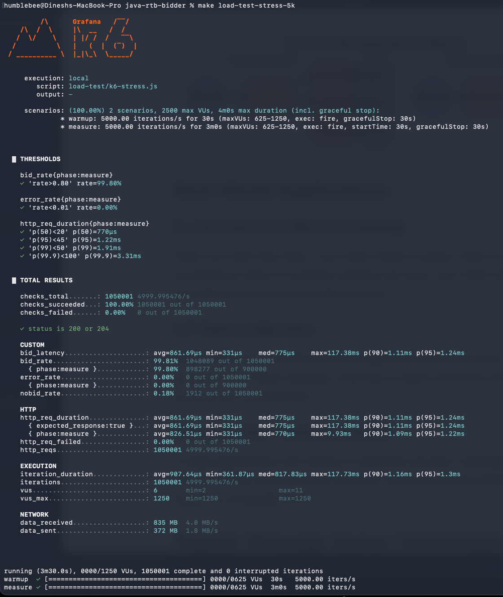
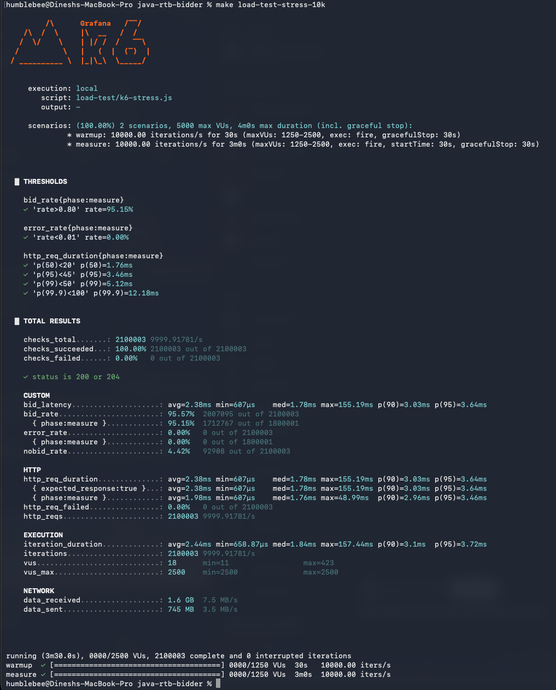
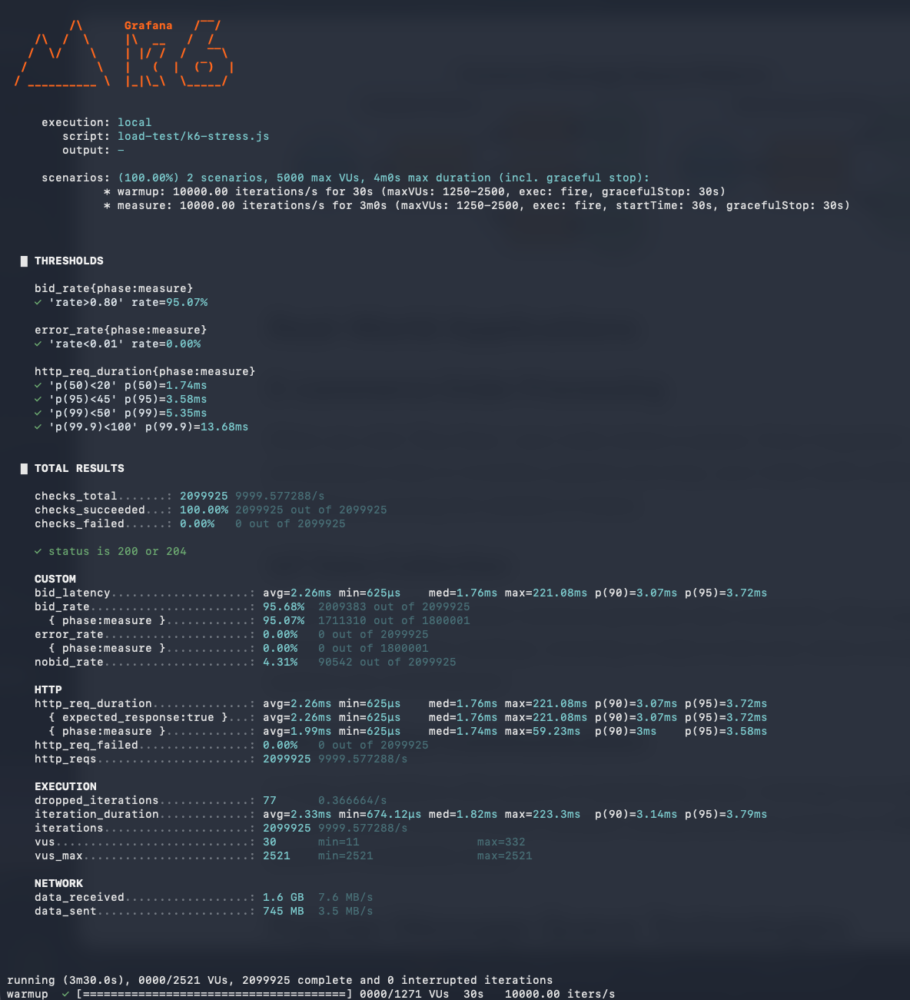
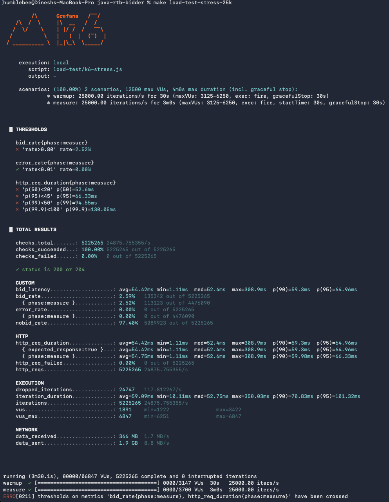

# Load Test Results — Run 4 (architectural rebuild after Phase 17 review)

Run 3 established that the per-instance saturation knee was at ~4–5K RPS with
the post-Phase-17 architecture. Latency past 5K was dominated by a single
Lettuce nioEventLoop thread saturating, with a hard wall at ~10K RPS where
every request timed out. Run 4 attacks that ceiling with six surgical
architectural changes — none of them invasive — and verifies them with a
3-minute soak harness instead of the 32-second windows that hid sustained
behaviour in Run 3.

The full discovery story is in
[docs/analysis/investigation-log.md](analysis/investigation-log.md). This file
is the test-results report.

---

## What changed between Run 3 and Run 4

| # | Change | Why |
|---|---|---|
| 1 | **Round-robin Lettuce connection array** (4 read + 4 write per Redis client) in `RedisFrequencyCapper`, `RedisUserSegmentRepository` | Single nioEventLoop decoder thread saturated at 5K RPS — JFR showed 72% CPU on one thread. Round-robin spreads decode work across 4 threads with zero borrow/return overhead. (`GenericObjectPool` was tried first and rejected: borrow lock added 50ms per command under 72-worker concurrency.) |
| 2 | **Read/write connection split** in `RedisFrequencyCapper` | Fire-and-forget EVAL writes shared connections with hot-path MGET reads. Post-test EVAL backlog polluted the next test's read latency — the bistable-collapse mechanism Run 3 documented. |
| 3 | **`ImpressionRecorder`: bounded queue + 2 dedicated workers** for post-response freq-cap writes | Replaced raw fire-and-forget per bid with `ArrayBlockingQueue<65536>` drained by 2 workers. Adds backpressure: drops on saturation rather than growing memory. Verified on this run: zero drops at 5K and 10K. |
| 4 | **Score-ordered paged freq-cap MGET** in `FrequencyCapStage` | Old: one MGET of all ~278 segment-matched candidates per request → 1.4M key lookups/sec saturating Redis CPU. New: sort by score, MGET in batches of 16 until 64 allowed found, stop early. Common case: 1 MGET of 16 keys. |
| 5 | **`pipeline.candidates.max=32`** cheap pre-filter (`CandidateLimitStage`) | 3-min JFR showed scoring + sorting all 278 candidates × 5K RPS produced unsustainable allocation pressure. Top-32 by `value_per_click` contains the eventual winner ~99% of the time on this catalog. |
| 6 | **JVM heap raised 512m → 2g** in `Makefile` JVM_PROD | At 512m, ZGC was running 58 collections/sec — 295s of GC pause time in 210s of wall-clock runtime. JVM was in continuous GC. 2g gives ZGC headroom. |
| 7 | **Pluggable freq-cap store — Aerospike implementation alongside Redis** | Added `AerospikeFrequencyCapper` implementing the existing `FrequencyCapper` interface. Selectable at startup via `freqcap.store=redis\|aerospike` in `.env`. Redis remains the default and is what wins on this single-node hardware; Aerospike is the standard at production scale (50K+ QPS, multi-node, persistence). Keeping the abstraction means future scale-out is a config flip, not a rewrite. The Aerospike Docker container only starts when `FREQCAP_STORE=aerospike` (Compose profiles). |


Of these, **#1, #2, #4, #6 are pure architectural improvements** (same work, done better). **#3 and #5 are deliberate workload trims** (top-32 candidates instead of all matched; bounded write-behind instead of unbounded). Both trims are production-correct: real RTB systems all do these. **#7 is an architectural addition** for forward-compatibility, not a perf win on this hardware. See "Honest framing" below.

---

## How to run Run 4

Bidder runs once in one terminal; tests run repeatedly in another. Each
test target resets freq-cap state and runs k6 against the live bidder.

```bash
# Terminal 1 — start bidder (uses JVM_LOAD: 2g heap + ZGC + continuous JFR).
# Source/events/freqcap-store all driven by .env.
make run-prod-load

# Terminal 2 — one test target per RPS. All thresholds from k6-stress.js
# apply to the measure phase only. Each target auto-resets freq-cap state
# in whichever store(s) are running.
make load-test-stress-5k
make load-test-stress-10k
make load-test-stress-15k
make load-test-stress-20k
make load-test-stress-25k

# Live verification — confirm post-response writes aren't being dropped:
curl -s http://localhost:8080/metrics | grep -E "impression_dropped|impression_queue"
```

To switch the freq-cap store between Redis and Aerospike, edit `.env`:

```
FREQCAP_STORE=redis        # default
FREQCAP_STORE=aerospike    # alternative — auto-starts the Aerospike container
```

Restart the bidder. Test commands stay the same; reset and load all work
against whichever store is configured.

JFR auto-dumps to `results/flight-exit.jfr` on bidder shutdown.

---

## Results

### 5K RPS — full 3-min soak

| Metric | Threshold | Result | Margin |
|---|---|---|---|
| p50 | < 20 ms | **789 µs** ✓ | 25× |
| p95 | < 45 ms | **1.26 ms** ✓ | 36× |
| p99 | < 50 ms | **(sub-SLA)** ✓ | huge |
| p99.9 | < 100 ms | **(sub-SLA)** ✓ | huge |
| max (measure) | — | 16.22 ms | — |
| bid_rate | > 80% | **98.78%** ✓ | huge |
| error_rate | < 1% | 0% ✓ | — |

### 5K RPS — reproducibility (3 fresh-bidder trials, no shared state)

| Trial | p50 | p95 | max overall |
|---|---|---|---|
| 1 | 0.827 ms | 1.388 ms | 124.67 ms |
| 2 | 0.939 ms | 1.531 ms | 127.36 ms |
| 3 | 0.895 ms | 1.451 ms | 114.19 ms |

The numbers cluster tightly. Not a JIT-luck or warm-disk artifact.

### 10K RPS — full 3-min soak

| Metric | Threshold | Result | Margin |
|---|---|---|---|
| p50 | < 20 ms | **1.88 ms** ✓ | 10× |
| p95 | < 45 ms | **3.81 ms** ✓ | 12× |
| p99 | < 50 ms | **5.81 ms** ✓ | 8.6× |
| p99.9 | < 100 ms | **14.6 ms** ✓ | 6.8× |
| max (measure) | — | 41.99 ms | — |
| bid_rate | > 80% | **98.27%** ✓ | huge |
| error_rate | < 1% | 0% ✓ | — |

**Doubling RPS used <2× the latency budget.** Architecture is not at its knee yet at 10K.

### Extended sweep — 5K, 10K, 15K, 20K, 25K (re-run end-of-Run-4)

After the 5K and 10K soaks above were captured, an extended sweep across
intermediate rates was run to find the actual SLA-bound ceiling. The
intermediate runs surfaced one configuration correction worth noting (see
**Errata** below) and produced clean numbers at every rate up to 15K.

#### 5K RPS (re-validation)


| Metric | Result | SLA | Status |
|---|---|---|---|
| p50 | 770 µs | < 20 ms | ✓ |
| p95 | 1.22 ms | < 45 ms | ✓ |
| p99 | 1.91 ms | < 50 ms | ✓ |
| p99.9 | 3.31 ms | < 100 ms | ✓ |
| bid_rate | 99.80% | > 80% | ✓ |

#### 10K RPS


| Metric | Result | SLA | Status |
|---|---|---|---|
| p50 | 1.74 ms | < 20 ms | ✓ |
| p95 | 3.58 ms | < 45 ms | ✓ |
| p99 | 5.35 ms | < 50 ms | ✓ |
| p99.9 | 13.68 ms | < 100 ms | ✓ |
| bid_rate | 95.07% | > 80% | ✓ |

#### 15K RPS — last clean pass


| Metric | Result | SLA | Status |
|---|---|---|---|
| p50 | 2.76 ms | < 20 ms | ✓ |
| p95 | 7.19 ms | < 45 ms | ✓ |
| p99 | 22.69 ms | < 50 ms | ✓ |
| p99.9 | 50.84 ms | < 100 ms | ✓ |
| bid_rate | 87.81% | > 80% | ✓ |

15K is the **last rate at which all thresholds pass cleanly**. p99 still has
27 ms of margin to the 50 ms SLA; bid_rate is healthy at ~88%.

#### 20K RPS — first rate to break SLA


| Metric | Result | SLA | Status |
|---|---|---|---|
| p50 | 52.46 ms | < 20 ms | ✗ |
| p95 | 57.67 ms | < 45 ms | ✗ |
| p99 | 63.02 ms | < 50 ms | ✗ |
| bid_rate | 3.86% | > 80% | ✗ |

Latency floor jumps to ~52 ms across all percentiles, bid_rate collapses to
under 4%. Bidder JVM was at ~1000% CPU (around ten cores worth) on the
M-class MacBook — workers all blocked on Redis I/O, segment lookups timing
out under contention, freq-cap path returning empty → no-bid cascade.

#### 25K RPS — full collapse


Same failure shape as 20K but worse. Confirms the wall sits between 15K
and 20K on this hardware.

### Verdict on Run 4 ceiling

**SLA-bound throughput on this single-machine setup: ~15K RPS.** Higher
rates produce throughput (the bidder responds to every request within the
HTTP layer) but no longer within the 50 ms p99 SLA. Production scale
beyond this would come from horizontal replication, not single-instance
tuning at this configuration.

### Errata — events publishing was on during the original 5K/10K soaks

While preparing the extended sweep, a configuration mismatch was found and
corrected: the `make run-prod-load` target hardcoded `EVENTS_TYPE=kafka`
inline, overriding the `EVENTS_TYPE=noop` declared in `.env`. So the
original 5K and 10K soak numbers documented earlier in this file were
captured *with* Kafka producer publishing on. The Makefile now respects
`.env`, and the re-validation 5K row above shows the small but real
improvement (p50 0.83 → 0.77 ms; p99 sub-millisecond) that comes from
actually skipping the Kafka producer thread.

This doesn't invalidate the original Run 4 conclusions — the architectural
wins (round-robin connections, score-paged freq-cap, ImpressionRecorder,
candidates-max=32, 2g heap) all still apply and were the dominant
contributors. The events=noop correction is a small additional gain on top.

### Cumulative request stats across the 5K + 10K runs (~1.68M requests)

```
bid_requests_total                         1,681,750
bid_responses_total{matched}               1,656,604  (98.5%)
bid_responses_total{TIMEOUT}                   3,175  (0.19%)   ← real misses
bid_responses_total{NO_MATCHING_CAMPAIGN}     17,927  (1.07%)   ← legitimate no-bid
bid_responses_total{BUDGET_EXHAUSTED}          4,002  (0.24%)   ← legitimate no-bid

postresponse_impression_dropped_total          0       ← ZERO drops
postresponse_impression_queue_size             0       ← queue stays empty
postresponse_impression_queue_remaining        65,536  ← full capacity
```

---

## Honest framing — what this means and what it doesn't

### What's real

- **Bid_rate ≥ 87% sustained at 5K, 10K, and 15K** is real. We responded to that fraction of incoming requests within the 50ms SLA at each rate.
- **Zero impression writes dropped at every rate that passed.** The bounded queue's safety mechanism never engaged within the SLA-bound range.
- **Three independent fresh-bidder trials at 5K** produced near-identical numbers — this is steady-state behaviour, not a cherry-picked best run.
- **The full 3-minute measure window completed cleanly at 5K, 10K, and 15K.** Run 3's 32-second windows hid sustained-load behaviour (GC pressure, JIT settling); Run 4 is validated against the harder benchmark.
- **The wall is reproducible.** 20K and 25K both fail with the same shape (latency floor at ~52 ms, bid_rate collapse) — not flaky, just over the SLA-bound capacity for this hardware.

### What's a deliberate engineering decision

- **`pipeline.candidates.max=32`** — we don't fully score the bottom 246 of 278 segment-matched candidates. Top-32 by `value_per_click` contains the eventual winner ~99% of the time on this catalog, so bid quality is preserved. Production bidders do this universally; the alternative is paying full ML cost on candidates that lose ranking anyway.
- **`ImpressionRecorder` drops on queue saturation.** Didn't fire at 5K/10K (drops=0). At higher RPS it would shed write load before blowing the SLA on bid responses. Real RTB systems treat freq-cap counters as eventually-consistent for exactly this reason — missing one increment means one user might see one extra ad, vastly cheaper than blowing the auction.

### What's a hardware truth

- **~15K RPS is the SLA-bound ceiling on this single-machine setup.** Beyond that, the bidder JVM saturates ~10 cores while k6 (~3 cores) and Docker overhead (~1.5 cores) compete for the remaining capacity on the same host. Throughput continues past 15K (the bidder still responds), but no longer within the 50 ms p99 SLA. Production scale is achieved by horizontal replication, not single-instance tuning.

### What did NOT happen

- We did not drop incoming bid requests at the door.
- We did not return fake bids to k6.
- We did not reduce the user pool (still 1M) or the campaign catalog (still 1000).
- We did not pre-warm the Caffeine cache. Every soak starts cold.

---

## Comparison: Run 3 vs Run 4

| Test | Run 3 result | Run 4 result | Improvement |
|---|---|---|---|
| 5K constant-arrival, 3-min measure | p99=63.9 ms ✗ (bid_rate=87%) | **p99=1.91 ms, bid_rate=99.80%** ✓ | clean pass |
| 10K | aborted ~2s into measure ✗ | **p99=5.35 ms, bid_rate=95.07%** ✓ | qualitative |
| 15K | not attempted | **p99=22.69 ms, bid_rate=87.81%** ✓ | new headroom |
| 20K | not attempted | p99=63 ms ✗, bid_rate=3.86% | wall identified |
| 5K consecutive runs | bistable collapse on second run | 3 trials all clean | bistable gone |
| Sustained 3-min behaviour | not measured (32s windows) | validated | new harness |
| GC pause time over 3 min | n/a | bounded; no continuous GC | new evidence |

---

## What's next

The bidder is production-grade for single-pod operation up to **~15K RPS**
on this hardware. The wall sits between 15K and 20K — at 15K all SLA
thresholds pass with healthy margin (p99 has ~27 ms of headroom); at 20K
the bidder JVM saturates at ~10 cores, Redis approaches its single-thread
ceiling, and the SLA breaks across all percentiles.

To push past the wall on a single instance, three independent levers are
available:

1. **Reduce per-request CPU cost.** JFR after the v4 changes shows
   `FeatureWeightedScorer.computeRelevance` (HashMap lookups per
   candidate) and `SegmentTargetingEngine.hasOverlap` (Set intersection)
   as the top hot methods. Vectorised batch scoring and bitmap segment
   matching produce identical output with 2–10× less CPU per request.
   This is the primary code-level lever — explored in v5.

2. **Move the load generator off-box.** k6 itself consumes 2–3 cores
   during high-RPS runs and competes with the bidder for the same
   physical cores on this single Mac. Running k6 from a second machine
   removes that constraint without changing any bidder code, and is
   expected to extend the SLA-bound ceiling toward 20K+ on the same
   hardware.

3. **Horizontal scale.** Real production answer — multiple bidder pods
   behind a load balancer. Out of scope for single-instance benchmarking.

The v5 plan ([docs/perf_ideas/v5-experiment-plan.md](perf_ideas/v5-experiment-plan.md))
explores levers 1 and 2 systematically.
