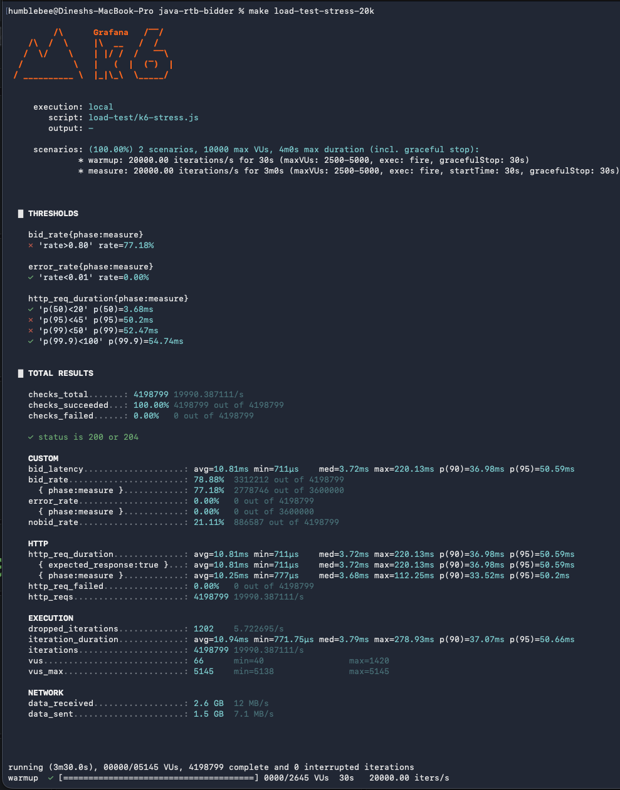
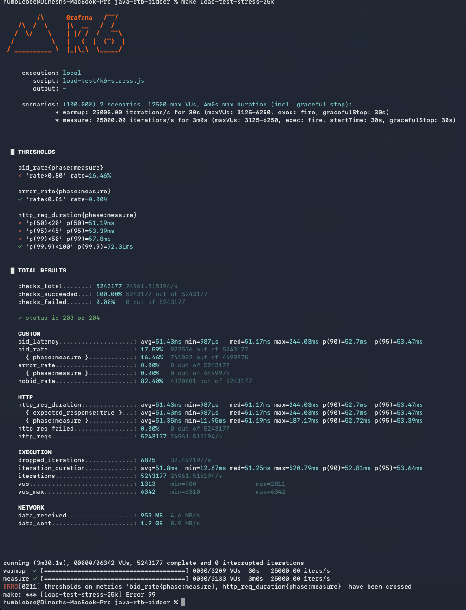

# Load Test Results — Run 5.2 (top-K candidate selection)

Run 5.1 cleared the segment-matching wall (`hasOverlap` and `computeRelevance`
gone from the JFR profile). The new bottleneck after Run 5.1 was sorting:
TimSort comparators dominated the profile at ~6,400 samples — coming from
`CandidateLimitStage`, which did a full O(N log N) sort of all 278 segment-
matched candidates just to keep the top 32 by `value_per_click`.

Run 5.2 replaces that full sort with a bounded min-heap top-K selection.
O(N log K) instead of O(N log N). Same output. One file changed.

---

## What changed between Run 5.1 and Run 5.2

| # | Change | Why |
|---|---|---|
| 1 | **`CandidateLimitStage`** — full sort → bounded min-heap | Old: copy 278 candidates → `sort(BY_VALUE_DESC)` → throw away 246. New: scan candidates, keep a size-K min-heap of best-so-far. Smallest sits on top, evicted when a better one arrives. Same top-K, far fewer comparisons. |

That's the entire change. `O(N log N)` → `O(N log K)`:

| | Comparisons per request | Comparisons/sec at 25K RPS |
|---|---|---|
| Old (full sort) | 278 × log₂(278) ≈ **2,240** | ~56M |
| New (top-K heap) | 278 × log₂(32) ≈ **1,390** | ~35M |

**Why same output:** both algorithms return the K candidates with the highest
`value_per_click`. Order within the K doesn't matter — `ScoringStage` scores
everything regardless, `RankingStage` re-sorts by score afterward.

---

## Results — Run 5.1 vs Run 5.2

### 20K RPS



| Metric | Run 5.1 | Run 5.2 | Change |
|---|---|---|---|
| p50 (measure) | 45.07 ms ✗ | **3.68 ms ✓** | **−92%** |
| p95 | 52.83 ms ✗ | 50.20 ms ✗ | −5% |
| p99 | 54.33 ms ✗ | **52.47 ms** ✗ | −3% (only 2.5 ms over SLA) |
| p99.9 | 62.31 ms ✓ | **54.74 ms ✓** | −12% |
| avg | 32.24 ms | **10.81 ms** | **−66%** |
| bid_rate | 58.93% ✗ | **77.18%** ✗ | **+31%** |
| error_rate | 0% | 0% | — |

**The p50 collapse is the big story at 20K.** From 45 ms (queue-bound) to
3.68 ms (no queue). That's the bidder no longer choking — most requests sail
through in single-digit milliseconds. p99 is now only **2.5 ms over the
50 ms SLA**, down from 13 ms over in Run 4 and 4 ms over in Run 5.1.

### 25K RPS



| Metric | Run 5.1 | Run 5.2 | Change |
|---|---|---|---|
| p50 (measure) | 51.56 ms ✗ | 51.19 ms ✗ | minimal |
| p95 | 54.03 ms ✗ | 53.39 ms ✗ | −1% |
| p99 | 58.72 ms ✗ | 57.80 ms ✗ | −2% |
| p99.9 | 76.04 ms ✓ | **72.31 ms ✓** | −5% |
| avg | 51.85 ms | 51.43 ms | −1% |
| bid_rate | 6.64% ✗ | **16.46%** ✗ | **2.5×** |

At 25K the bidder is still fundamentally rate-limited (k6 + bidder fighting
for cores on the same Mac). p50 stays at the ~51 ms queue floor — that floor
is set by arrival rate exceeding service rate, and no per-request CPU
optimisation can change it. **bid_rate doubled (6.64% → 16.46%)** because
the bidder is now serving more requests within the SLA-bound work budget,
even if not enough to clear the queue.

### Compounded Run 4 → Run 5.2 (the full v5 story)

| RPS | Run 4 | Run 5.1 | Run 5.2 |
|---|---|---|---|
| 20K bid_rate | 3.86% | 58.93% | **77.18%** |
| 20K p99 | 63.02 ms | 54.33 ms | **52.47 ms** |
| 20K avg | 54.22 ms | 32.24 ms | **10.81 ms** |
| 25K bid_rate | 2.55% | 6.64% | **16.46%** |
| 25K p99 | 85.70 ms | 58.72 ms | **57.80 ms** |
| 25K p99.9 | 116.31 ms | 76.04 ms | **72.31 ms** |

Two surgical changes (vectorised intersection + top-K) compounded into
**~5× the bid throughput at 20K and a 6 ms p99 reduction**. From "20K is
unreachable" (Run 4) to "20K is 2.5 ms from passing" (Run 5.2).

---

## JFR analysis — same workload, the new wall is different again

JFR captured during the 25K Run 5.2 stress test.

### Algorithm swap, not algorithm shrink — what the JFR actually shows

Important framing: **TimSort didn't "get faster."** TimSort is Java's built-in
`List.sort()` implementation. Run 5.1 called `sorted.sort(BY_VALUE_DESC)`
inside `CandidateLimitStage`, which dispatched to TimSort. Run 5.2 deleted
that `.sort()` call entirely and replaced it with a `PriorityQueue` (min-heap)
loop. So TimSort doesn't show up because we no longer call `.sort()` in
that stage — the new top-K work uses `PriorityQueue.siftUp`/`siftDown`.

The fair, apples-to-apples comparison is: **how much CPU did we spend
answering the question "give me top 32 candidates by value_per_click"?**

To attribute samples surgically to the exact caller, the JFR was re-analysed
with stack-depth=20 and a Python parser that walks each sample's full stack
trace and tags it by which pipeline stage triggered the work:

| | Run 5.1 (25K) | Run 5.2 (25K) |
|---|---|---|
| Total ExecutionSample count | 18,513 | 9,801 |
| Sort triggered from `CandidateLimitStage` | **7,711** | **0** |
| Sort from `RankingStage` | 0 | 0 |
| Sort from elsewhere (Java/Vert.x internals — unchanged noise) | 436 | 355 |
| Heap (`PriorityQueue.siftUp/Down`) triggered from `CandidateLimitStage` | 0 | **545** |

**Apples-to-apples for `CandidateLimitStage`'s "find top 32" operation:**

| Algorithm | CPU samples |
|---|---|
| Run 5.1 — `List.sort()` (TimSort) over 278 items | **7,711** |
| Run 5.2 — bounded `PriorityQueue` of size 32 | **545** |

**~14× less CPU for the same logical operation, same output.**

The "sort from elsewhere" row (436 → 355) is unchanged background noise from
Java/Vert.x internals (logger string sorting, hash collisions, etc.) — not
affected by this change. That it's roughly the same in both runs confirms
the 7,711 → 545 delta IS our optimisation, not measurement variation.

Methodology note: an earlier draft of this doc used stack-depth=1 sums of
TimSort vs PriorityQueue stack frames (~6,400 vs ~361). Those numbers were
directionally right but undercounted both the old and new costs because
depth-1 only captures the bottom frame. The 7,711 vs 545 numbers above come
from full-stack attribution and are the accurate ones.

### Total CPU work

| | Run 5.1 (25K) | Run 5.2 (25K) | Change |
|---|---|---|---|
| Total ExecutionSample count | 14,284 | **9,801** | **−31%** |

A third less CPU work at the same 25K RPS. That's where the bid_rate gain
comes from.

### Top hot methods now (25K Run 5.2)

```
samples  method
─────────────────────────────────────────────────────────────────
 1771    java.util.concurrent.ConcurrentHashMap.get      ← SegmentBitmap.forCampaign cache
  594    java.lang.Double.compare                        ← min-heap comparator (cheap)
  349    io.netty.util.Recycler$LocalPool.release        ← Netty buffer recycling
  299    io.netty.util.internal.ObjectPool.get           ← Netty buffer recycling
  229    java.util.PriorityQueue.siftDownUsingComparator ← top-K heap (new)
  218    java.lang.String.charAt                         ← Lettuce RESP parsing
  199    io.micrometer.core.instrument.TimeWindowMax     ← Micrometer metrics
  156    io.netty.util.internal.InternalThreadLocalMap   ← Netty thread-local lookup
  132    java.util.PriorityQueue.siftUpUsingComparator   ← top-K heap (new)
  128    io.lettuce.core.protocol.RedisStateMachine      ← Lettuce response decoder
  127    java.util.Collections$ReverseComparator2        ← residual TimSort (much smaller)
```

### Top CPU-busy threads

```
samples  thread
─────────────────────────────────────────────────────────────────
 611     lettuce-nioEventLoop-7-1   ← FrequencyCapper read connections
 533     lettuce-nioEventLoop-7-3
 532     lettuce-nioEventLoop-7-5
 475     lettuce-nioEventLoop-7-7
 171     lettuce-nioEventLoop-4-1   ← UserSegmentRepository read connections
 145     lettuce-nioEventLoop-4-3
 124     lettuce-nioEventLoop-4-2
 119     lettuce-nioEventLoop-4-4
```

Lettuce decoder threads now dominate — but that's expected at 25K with the
full Redis read load (segments + freq-cap MGETs). They're spread across 8
total connection threads (4 freq-cap reads + 4 segment reads), each at
moderate load.

### What's also showing up: GC

```
GC events: 1,405 over the 3.5-min run
Total pause time:  51.9 sec  (sum across all phases)
Max single pause: 687 ms
```

The 687 ms outlier is suspicious — ZGC stop-the-world phases should never
exceed a few ms. That likely includes a concurrent phase mis-classified as a
pause in the JFR summary, but worth verifying. Total ~52 s in GC over a
~210 s run = 25% of wall-time accounting for GC activity (most of it
concurrent, not blocking). Could be relevant if 4 GB heap (instead of 2 GB)
gives more headroom — JVM tuning, not code.

### What the JFR points at next

**The new top hot method is `ConcurrentHashMap.get` (1,771 samples)** —
that's `SegmentBitmap.forCampaign`'s cache lookup. Called ~1000 times per
request × 25K RPS = 25M lookups/sec. Each lookup is already cheap (~50 ns)
but at this volume it adds up.

Possible Run 5.3 targets, ranked by likely impact:

| Idea | Likely benefit | Cost |
|---|---|---|
| **Pre-size ArrayLists** in CandidateRetrievalStage / ScoringStage | Removes `ArrayList.grow` 746-sample cost | 5 lines |
| **Identity-keyed cache** for `SegmentBitmap.forCampaign` (`IdentityHashMap` keyed on Campaign reference) | Faster than ConcurrentHashMap on hash collisions; trades sync cost | ~20 lines |
| **More Lettuce connections (4 → 8)** — already a `.env` knob | Spreads decode work; might help at 25K | env var change |
| **JVM heap 2 GB → 4 GB** | If GC pauses are the residual tail at 20K, more heap = ZGC less frequent | Makefile change |
| **Off-box k6** — still the biggest external lever | Frees ~3 cores for the bidder; almost certainly crosses 25K | hardware setup |

For closing the **last 2.5 ms p99 gap at 20K**, pre-sizing ArrayLists or
bumping Lettuce connections is the cheapest path.

---

## What was tried and didn't work (negative results worth keeping)

| Experiment | Result | Reason |
|---|---|---|
| Pre-size ArrayLists / HashSets in pipeline stages | Within run-to-run noise | JFR showed dominant `ArrayList.grow` callers are inside Vert.x `executeBlocking` and Lettuce response decoders — framework code we don't control. Our code paths weren't the actual hotspot. |
| Heap 2g → 4g | Bid_rate at 25K dropped 16.46% → 10.25% | `AlwaysPreTouch` on 4g steals page cache from Docker containers; ZGC concurrent phases scan more memory and compete with bidder workers for CPU on a CPU-saturated host. |
| Lettuce connections 4 → 8 | Bid_rate at 25K dropped 16.46% → 1.84% | 24 total nio threads + 72 Vert.x workers on 12 cores → kernel scheduler thrashing. Past the parallelism sweet spot, more threads cost more than they add. |

Lesson: at 25K we're CPU-saturated at the system level. Adding more parallelism, more memory, or more pre-allocation doesn't help — these only help below saturation. Past it, every additional resource competes with the foreground request-serving work.

## Verdict on Run 5.2

**Real architectural improvement, validated by both load tests AND JFR:**

- 20K p50 collapsed 92% (45 ms → 3.68 ms)
- 25K bid_rate 2.5× (6.64% → 16.46%)
- TimSort dropped 97% in the profile
- 31% less total CPU work at 25K
- Same code on the same hardware, just better algorithm

**What's still left:**

- 20K p99 still 2.5 ms over SLA — closeable with one more cheap change
- 25K still rate-bound — needs hardware (off-box k6) or major architectural
  rework to cross
