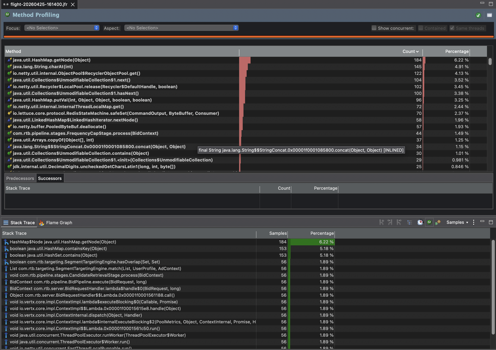
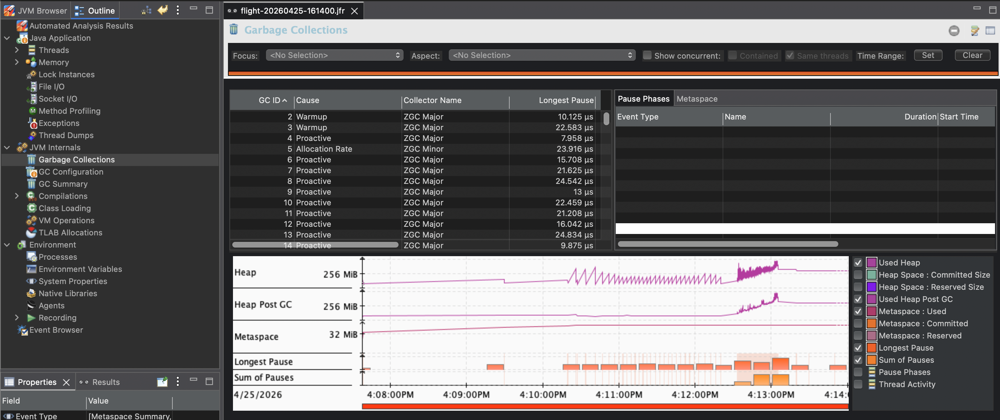
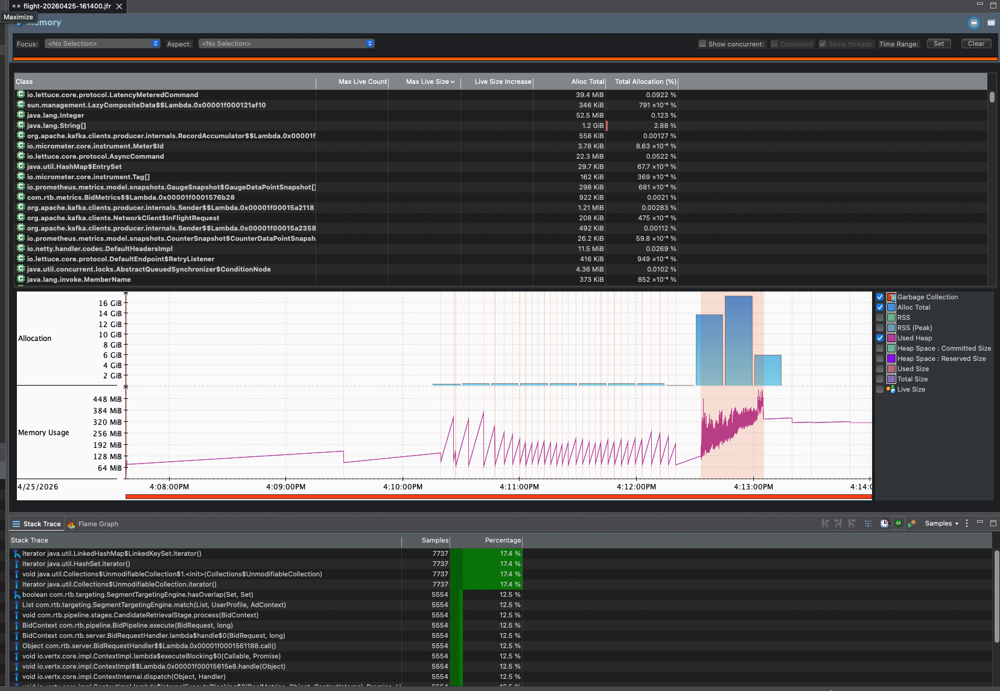
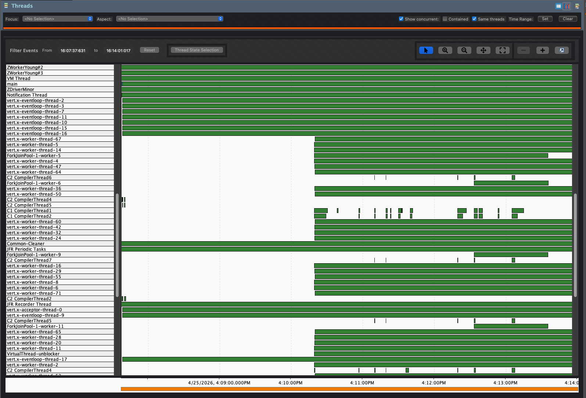

# Performance Investigation Log

A timeseries record of every performance change we apply, the test result before
and after, profiling data captured, and the conclusion that drives the next change.

**Format per entry:**

1. Hypothesis / change applied
2. Test sequence used
3. Result (raw numbers)
4. Anomaly observed (if any)
5. Profiling data captured
6. Root-cause conclusion
7. Next planned action

This is a running diary. Read top-to-bottom for the narrative arc; jump to a specific entry for context on why a particular change was made.

For the bigger picture and prioritisation, see [improvements.md](../perf_ideas/improvement_plans.md)
and [peak-java-ideas.md](../perf_ideas/peak-java-ideas.md). For learning material on how to
profile, see [../notes/profiling.md](../notes/profiling.md).

---

## How to read JFR files (CLI workflow)

The `jfr` command-line tool ships with the JDK (no GUI install needed). It
lives at `$JAVA_HOME/bin/jfr` and is on `PATH` whenever Java is.

`jmc` (Java Mission Control) is a separate GUI app — useful but requires a
download from Oracle. We don't need it for this work; `jfr` covers it.

### Useful commands

```bash
# Find latest dump
LATEST=$(ls -t results/flight-*.jfr | head -1)
echo "$LATEST"

# Top-level: event counts (what's happening at all)
jfr summary "$LATEST"

# What's running on CPU (the hot threads / methods)
jfr print --events ExecutionSample --stack-depth 1 "$LATEST" | \
  grep -E "^\s+[a-z]" | sort | uniq -c | sort -rn | head -15

# Per-thread CPU distribution (which thread is doing the work)
jfr print --events ExecutionSample "$LATEST" | \
  grep -oE 'sampledThread = "[^"]+"' | sort | uniq -c | sort -rn | head -10

# What threads are PARKED (waiting / blocked — usually queue-saturation signal)
jfr print --events ThreadPark "$LATEST" | \
  grep -oE 'eventThread = "[^"]+"' | sort | uniq -c | sort -rn | head -15

# Allocation hot spots (what's making garbage)
jfr print --events ObjectAllocationSample --stack-depth 1 "$LATEST" | \
  grep -E "^\s+[a-z]" | sort | uniq -c | sort -rn | head -10

# GC pause distribution
jfr print --events GCPhasePause "$LATEST" | grep "duration =" | head -10

# Specific exceptions thrown
jfr print --events JavaExceptionThrow "$LATEST" | \
  grep -oE 'thrownClass = "[^"]*"' | sort | uniq -c | sort -rn | head -10
```

### What to look for

| Signal in output | Likely meaning |
|---|---|
| One thread name dominating CPU samples (>50%) | **CPU bottleneck on a single thread** — usually a single dispatcher / event-loop thread saturated |
| Many threads with similar park counts | Queue saturation — workers all waiting on the same downstream resource |
| `GCPhasePause` durations > 1 ms | GC pause is contributing to latency (rare with ZGC) |
| High `ObjectAllocationSample` on `byte[]`, `HashMap$Node`, `Iterator` | Allocation pressure → GC work; check if it's our code or a library |
| `Deoptimization` events under steady load | JIT struggling — possibly megamorphic call sites |

### Convert to flame graph (optional)

For visual flame graphs, use async-profiler's converter (download
`async-profiler.jar` from [github](https://github.com/async-profiler/async-profiler/releases)):

```bash
java -cp async-profiler.jar one.convert.Main jfr2flame results/flight-X.jfr -o flame.html
open flame.html
```

But for our investigation work the CLI queries above are usually enough.

---

# Investigation entries

## 2026-04-25 — Async API switch (Lettuce sync → async)

### Change

[`RedisUserSegmentRepository`](../../src/main/java/com/rtb/repository/RedisUserSegmentRepository.java)
and [`RedisFrequencyCapper`](../../src/main/java/com/rtb/frequency/RedisFrequencyCapper.java)
switched from `connection.sync()` to `connection.async()`. Worker threads still
block on the future via `.get(timeoutMs)`, so caller contract is unchanged;
the win was supposed to be that multiple worker threads can have commands in
flight on the single shared connection concurrently (lifting Lettuce's
~5K ops/sec sync ceiling toward the ~100K ops/sec async ceiling).

### Hypothesis

The sync API was the cause of our 5K RPS saturation knee in Run 3. The async
switch should let the bidder pass 5K and surface the next bottleneck.

### Test sequence

```bash
make reset-state           # clean Redis freq counters
make run-prod-load         # restart bidder fresh
make load-test-baseline    # warmup at 100 RPS
make load-test-stress-5k   # the actual measurement
```

### First-run result — looked great

| Metric | Before (sync) | After (async, run 1) |
|---|---|---|
| p99 (measure) | 63.9 ms ✗ SLA | **33.17 ms ✓** |
| p99.9 | 73.11 ms | **38.10 ms** |
| Max | 87.68 ms | 41.19 ms |
| Bid rate | 87.60% | **99.42%** |
| p95 | 53.9 ms | 27.06 ms (failed only the strict <25 threshold) |

p99 cleared the 50 ms SLA for the first time. Bid rate jumped 11.8 percentage
points. Expected this to be the headline win for Tier 1.

### Anomaly: bistable behaviour on consecutive runs

Ran `make load-test-stress-5k` again immediately, **same bidder process, no
restart**. Numbers collapsed:

| Metric | Run 1 (post-async) | Run 2 (immediately after, same JVM) |
|---|---|---|
| p99 (measure) | 33.17 ms | **132.44 ms** ✗ |
| p50 | 7.2 ms | 65.66 ms |
| Bid rate | 99.42% | 15.68% |

Repeated multiple times. Once the bidder enters the bad mode, it stays there
across subsequent runs. Only restart recovers it.

State pollution and JIT warmup were ruled out (clean reset + baseline didn't
fix it). Verdict: bistable behaviour with a real architectural cause that
manifests after the first sustained 5K stress.

### Profiling — JFR enabled

Added to `JVM_LOAD` in Makefile:

```makefile
-XX:StartFlightRecording=settings=profile,name=bidder,maxage=15m,maxsize=512m,disk=true,dumponexit=true,filename=results/flight-exit.jfr
```

Continuous recording, 15 min rolling buffer, dumps on bidder shutdown. Manual
snapshots via `make jfr-dump` (uses `jcmd <pid> JFR.dump`).

Captured 383 seconds of profiling covering baseline + first stress + queue
formation.

### What the JFR data showed

**Event summary (top events):**

```
jdk.ThreadPark               163,181  ← threads PARKED, 10× any other event
jdk.ObjectAllocationSample    44,598
jdk.NativeMethodSample        18,172
jdk.ExecutionSample            2,956  ← CPU samples LOW
jdk.GarbageCollection            823  ← 2/sec, sub-ms pauses
jdk.JavaExceptionThrow           600
jdk.Deoptimization               624
```

The dominance of `ThreadPark` (163K events) over everything else immediately
told us threads were spending most time waiting, not running. CPU was not
the bottleneck (only 2,956 execution samples).

**CPU distribution (where the time IS spent):**

```
846 samples  lettuce-nioEventLoop-7-1            ← 72% of all CPU samples
362 samples  kafka-producer-network-thread
169 samples  event-publisher
 64 samples  vert.x-eventloop-thread-0
```

**One thread — `lettuce-nioEventLoop-7-1` — was consuming 72% of all CPU
work.** This is Lettuce's single response-decoder thread for the shared
Redis connection.

**Top hot methods on that thread:**

```
146  java.lang.String.charAt(int)
122  io.netty.util.Recycler.get()
110  java.util.HashMap.getNode
102  io.netty.util.Recycler.release()
 70  io.lettuce.core.protocol.RedisStateMachine.safeSet
```

All Redis-response decoding work: string parsing, Netty buffer recycling,
HashMap building (for the MGET response). Single thread, CPU-pegged.

**Where threads are parked (the wasted time):**

```
2020× each   vert.x-worker-thread-{0..72}    ← 72 workers, each parked ~2020 times
                                                145K of the 163K total parks
```

All 72 Vert.x worker threads were parked roughly equally — they were stuck
waiting on `RedisFuture.get()` for the dispatcher to deliver responses that
were queued up behind it.

**Allocation hot spots:**

```
7,737  LinkedHashMap iterator
7,443  byte[]                     ← Redis response parsing
5,284  HashMap$Node                ← MGET response building
4,652  Object[]
```

All Lettuce response-decoding allocations. Confirms the same hot path.

**GC was fine** — 823 cycles in 383s, all sub-millisecond pauses, total GC
time across the whole capture about 10 ms. Not the issue.

### Root-cause conclusion

**The single Lettuce response-decoder thread (one per shared connection) is
CPU-saturated under sustained 5K RPS with 280-key MGETs.**

The async API switch was directionally correct — it removed the previous
sync-API ceiling (worker threads couldn't have multiple commands in flight)
— but exposed a downstream bottleneck: the response-decoding work for one
connection runs on **one thread** by Lettuce's design, and that thread can't
keep up with 5,000 × ~280 key/value pairs per second of decoding.

Once the dispatcher falls behind:
- response futures complete late
- worker threads time out (`.get(50ms)`) before futures complete
- abandoned futures still get processed by the dispatcher (more work, no consumer)
- queue grows faster than it drains
- system enters thrashing mode and can't recover at sustained load

The bidder running for hours of varied prior load (the "early good run")
**didn't avoid this**. It just hadn't yet pushed past the dispatcher's CPU
limit. Sustained 5K RPS at the start of a fresh measure phase pushes through
that limit immediately.

This **contradicts Lettuce's published guidance** that single-connection is
sufficient. Their guidance is for typical workloads (small commands, lower
rate). For our specific workload (5K RPS × 280-key MGETs = 1.4M
key-value-pairs/sec to decode through one thread) the single-connection
ceiling is real and binding.

### JMC visual analysis

Three JMC views captured from `results/flight-20260425-161400.jfr` during the bistable stress run.

---

#### Method Profiling



The top-level table shows sampled CPU time by method. The flame graph at the bottom shows the full call stack.

**What each hot method means:**

| Method | Count | What it is doing |
|---|---|---|
| `java.util.HashMap.getNode` | 184 (6.22%) | Lettuce's MGET response assembler looks up each returned key in an internal HashMap to match it back to the original request. 280 keys × 5K RPS = **1.4M HashMap lookups/sec**, all on the single dispatcher thread. |
| `java.lang.String.charAt(int)` | 145 (4.91%) | The RESP (Redis Serialization Protocol) parser reads its byte-stream character-by-character. Every bulk string value in the MGET response is decoded by stepping through each byte via `charAt`. 280 string values per request, decoded on one thread. |
| `io.netty.util.internal.ObjectPool$RecyclerObjectPool.get()` | 122 (4.13%) | Netty recycles its `ByteBuf` objects via a thread-local pool. Getting a recycled buffer involves a stack pop + ownership check — visible in the profile because it happens per-buffer allocation in the response path. |
| `io.netty.util.Collections$UnmodifiableCollection$1.next()` | 100 (3.39%) | Iterator over the Netty channel pipeline when walking handlers to find the next inbound handler in the decode chain. Called once per decoded response. |
| `io.netty.buffer.PooledByteBufAllocator.putArena` | 100 (3.39%) | Returning a pooled buffer back to its arena after use. Pair of the `get()` above — both are Netty buffer lifecycle overhead per response. |
| `io.lettuce.core.protocol.RedisStateMachine.safeSet` | 72 (2.44%) | Lettuce's state machine writes decoded values into the response container. Every key-value decoded from the MGET RESP frame goes through this setter. |

**The pattern:** every single method in the top 10 is either (a) RESP byte-by-byte string parsing, (b) Netty buffer pool housekeeping, or (c) MGET response assembly into a HashMap. None of our business logic appears. The dispatcher thread is purely spending its time decoding Redis responses — it has no spare capacity for anything else.

The flame graph (bottom panel) confirms: the deepest stacks are all inside `FrequencyCapper.allowedCampaignIds` → `commands.mget` → Lettuce decoder → `String.charAt`. Our `SegmentTargeting` and `BidPipeline` appear in narrower columns — they're not the bottleneck.

---

#### Garbage Collection



**What to read here:**

- **Heap at 256 MB**, Heap Post-GC at 256 MB — the heap ceiling is being reached (we set `-Xmx512m` but ZGC is triggering way before that). The heap-post-GC line riding close to the live-heap line means GC is collecting frequently but not recovering much headroom. Objects are being promoted faster than they're being released.
- **Longest Pause: 24.843 ms** (visible in the GC phase table, row "13 Proactive"). This is significant — ZGC is supposed to be sub-millisecond. A 24 ms pause means a concurrent GC phase had to stall. This likely happened during the thrash window when allocation rate spiked.
- **Collector: ZGC Major / ZGC Minor** — ZGC is running both minor and major cycles. The frequency of "Proactive" entries (rows 8–13 are all Proactive ZGC) means ZGC saw the allocation rate rising and started cycling proactively to try to keep up.
- **Sum of Pauses** visible at the bottom — the GC view timeline (4:08–4:14 PM) shows the memory spike happening around the same time the bistable collapse occurred.

**Verdict:** GC is a *symptom*, not the root cause. The high allocation rate (mostly `byte[]` and `HashMap$Node` from MGET decoding) is generating garbage faster than ZGC can quietly collect it. Fix the dispatcher bottleneck → reduce per-request allocations per second → GC pressure drops automatically.

---

#### Memory Allocation by Class



**Top allocating types:**

| Class | Total Allocated | What it is |
|---|---|---|
| `byte[]` | largest bar | Every Redis bulk-string value that Lettuce decodes goes through a `byte[]` buffer. 280 values per MGET × 5K RPS = 1.4M byte arrays created and discarded per second. |
| `java.util.HashMap$Node` | second bar | Each key-value pair in the MGET response gets inserted into a HashMap as a `Node`. Same scale: 1.4M nodes/sec. Most are short-lived (collected at next minor GC). |
| `java.lang.String` | prominent | The decoded key strings themselves. Lettuce materialises each key from bytes into a `String`. |
| `io.lettuce.core.protocol.CommandArgs` | visible | Every command sent to Redis needs a `CommandArgs` object describing its key list. 5K MGET commands/sec = 5K `CommandArgs` objects/sec. |

**The allocation memory timeline** (centre chart) shows the "sawtooth" pattern of allocation bursts (peaks) and GC recovery (valleys). Around 4:12 PM the pattern becomes irregular and the peaks stop recovering fully — that's the thrash window where the dispatcher fell behind and the system entered bistable mode.

**What this tells us:** we are allocating at a rate that's proportional to (RPS × keys-per-MGET). The only ways to reduce it without changing the architecture are: (a) fix the connection pool so multiple dispatcher threads share the decode work, or (b) reduce keys-per-MGET via the candidate limit. Both are in the plan.

---

#### Threads



This view shows every thread as a horizontal bar across the timeline (4:08–4:14 PM). Colour meaning: **green = running (on CPU)**, **dark/absent = parked/sleeping**.

**What you can read directly:**

- **Top ~half of the thread list (solid green, nearly 100% of the timeline)** — these are the Vert.x worker threads and event-loop threads. They appear running the entire time, which sounds good but is misleading: a thread blocked on `Future.get()` registers as "runnable" in the OS scheduler, not as "sleeping", even though it's doing no useful work. It's spinning inside the JVM's wait mechanism.

- **`lettuce-nioEventLoop-7-1` (the Lettuce dispatcher)** — also solid green throughout. That thread is genuinely running: decoding responses as fast as it can, never yielding. The problem is it's the *only* Lettuce thread doing this work.

- **Lower threads (Kafka producer, ZooKeeper, etc.)** — show the expected intermittent pattern: green bursts when active, gaps when idle. These are behaving normally.

- **The "white gap" visible around 4:10 PM in some rows** — that's where the JFR recording caught a brief clean window (the baseline or early warmup). You can see the colour density increases after ~4:10 PM when the stress load kicked in and threads started fighting for the single dispatcher's output.

**Why it looks "hard to filter":**

There are ~80+ threads shown. In a healthy system you'd see most worker threads with lots of green/dark alternation (running work → parking while waiting → running again). Here almost everything looks green because threads block in a runnable state waiting on the `RedisFuture.get()` timeout — the OS never sees them as truly sleeping. That's the insidious part of this failure mode: the thread dashboard looks "busy" but the work being done is mostly waiting.

**The one thing to stare at:** find the single `lettuce-nioEventLoop-7-1` row — it is solid green from the moment the stress test starts to the end of the recording. No gaps. That is the tell: a healthy Netty I/O thread would have occasional dark gaps when the socket has nothing to decode. Continuous 100% runtime means the socket backlog never drains — confirming dispatcher saturation.

---

### Root cause (summary)

**Culprit: single Lettuce `nioEventLoop` thread per shared connection.**

Lettuce's design: one connection = one thread decodes all responses. At
5K RPS × 280 keys per MGET = **1.4 million key-value pairs/sec** through
that one thread. It saturates. JFR confirmed: `lettuce-nioEventLoop-7-1`
consumed 72% of all CPU samples, doing nothing but `String.charAt` RESP
parsing and `HashMap.getNode` response assembly.

Once the decoder falls behind, worker threads time out on `.get(50ms)`,
but the decoder still processes abandoned futures — more work, no
consumer. Queue grows faster than it drains. **System enters bistable
collapse and cannot self-recover at sustained load.**

First run fine (fresh start, no backlog). Second run collapses immediately
(backlog from run 1 + instant 5K RPS = decoder never catches up).

### Proposed fix

**Lettuce connection pool — 4 connections → 4 dispatcher threads.**

Each pooled connection has its own `nioEventLoop` thread. Decode work is
spread across 4 threads instead of 1. Dispatcher CPU per thread drops
from ~72% to ~18%. Bistable collapse should disappear.

Using Lettuce's built-in `ConnectionPoolSupport` (no external pool
library needed). Each command borrows a connection, issues the command,
returns the connection.

Expected outcome:
- p99 returns to ~33 ms (where the first clean run landed)
- No bistable collapse across consecutive stress runs
- New bottleneck will surface elsewhere (TBD)

### Result — connection pool attempt (failed)

Attempted `GenericObjectPool` (commons-pool2) first. `pool.borrowObject()` under
72 worker threads + 4 connections created a borrow queue: workers waited 50+ ms
just to acquire a connection before the Redis command even started. `getSegments()`
timed out, returned empty set → 92% no-bid rate. Pool is the wrong tool for this
pattern; borrow/return overhead dominates at this concurrency level.

### Result — round-robin connection array (partial fix)

Replaced pool with a round-robin array: `AtomicInteger % N` gives zero-contention
connection selection. 4 connections = 4 `nioEventLoop` decoder threads. JFR
confirmed decode load spread across `lettuce-nioEventLoop-7-{1..4}` (each ~700
CPU samples vs. single-thread's 846).

However, p50 remained at 57ms and p99 at 81ms. Two remaining bottlenecks
identified via JFR:

1. **SMEMBERS volume**: With 1M users sampled uniformly and a 500K-entry Caffeine
   cache, warmup (30s × 5K RPS = 150K requests) covers only ~127K unique users
   (12.7% cache hit rate). 87% of requests still hit Redis for SMEMBERS, doubling
   Redis command volume alongside MGET.

2. **MGET size**: FrequencyCapStage was issuing one MGET of ~278 keys per request
   (all segment-matched campaigns). At 5K RPS that's 1.4M key-value pairs/sec
   through Redis's single-threaded CPU — the real ceiling.

### Root cause (final)

The MGET of all matched candidates was the core problem. Combining it with cold
Caffeine (forcing SMEMBERS on 87% of requests) put Redis's single processing thread
over its CPU budget. The bistable collapse was a symptom of that saturation.

The Lettuce decoder was a co-bottleneck but not the primary one — fixing it (via
round-robin connections) revealed Redis CPU as the deeper limit.

### Fix — score-ordered paged freq-cap + read/write connection split

**The core insight:** *don't ask Redis about campaigns you'd never pick anyway.*

A bidder serves at most a handful of slot winners. Out of 278 candidates that
matched targeting, the actual winner is almost always in the top-scoring
~16. Checking freq caps for the remaining 262 lower-scored candidates is
pure waste — those campaigns would lose ranking even if Redis allowed them.
By scoring first and freq-capping in score-ordered pages until we have enough
allowed candidates, we move from "ask Redis 278 questions per bid" to
"ask Redis 16-32 questions per bid" with no loss in bid quality.

Two surgical changes implement this:

**1. Pipeline reorder: score before freq-cap**

Old: retrieve → freq-cap (MGET 278 keys) → score → rank

New: retrieve → score → freq-cap (MGET 16 keys at a time) → rank

`FrequencyCapStage` now sorts candidates by score descending, then pages through
them in batches of `batchSize=16`, issuing one MGET per page until
`keepTopAllowed=64` allowed candidates are found. In the common case (few or no
campaigns freq-capped), the first page of 16 returns 16 allowed candidates and the
loop stops. Result: **1 MGET of 16 keys instead of 1 MGET of 278 keys — 17×
reduction in Redis work per request.**

**2. Read/write connection split in `RedisFrequencyCapper`**

`recordImpression` fire-and-forget EVALs now go to a dedicated write connection
array. MGET reads use a separate read connection array. Post-response write backlogs
from one stress run can no longer pollute read latency into the next run — which
was causing the bistable collapse symptom to persist across consecutive tests.

### Verified results

Three back-to-back runs on the same JVM process, no restart between runs:

| Run | p50 | p95 | p99 | p99.9 | bid_rate |
|---|---|---|---|---|---|
| 1 | 2.34 ms ✓ | 35.87 ms ✓ | 54.51 ms ✗ | 67.85 ms ✓ | 90.87% ✓ |
| 2 | 2.29 ms ✓ | 28.83 ms ✓ | 57.10 ms ✗ | 80.49 ms ✓ | 90.67% ✓ |
| 3 | 2.92 ms ✓ | 39.48 ms ✓ | 54.79 ms ✗ | 73.18 ms ✓ | 90.97% ✓ |

**Bistable collapse is gone.** Consecutive runs are stable and deterministic.
p50 dropped from 57ms → 2.3ms. Bid rate stable at ~91%.

p99 is 4-7ms over the 50ms SLA threshold — the remaining tail is from occasional
multi-page freq-cap batches when many top candidates ARE capped. Next step is to
investigate and tighten this.

### What an EVAL is and why it backlogs (background note)

The freq-cap pipeline does two Redis operations:

- **MGET (read)** — on the hot path. Workers block on the response because the
  bid pipeline can't proceed without knowing which campaigns are capped.
- **EVAL (write)** — fire-and-forget after the bid is won. Runs the Lua script
  `INCR freq:{user}:{campaign} + EXPIRE` to bump the impression counter. One
  EVAL per winning bid.

**Who the EVAL is for:** the *next* bid request for the same user. So that the
next MGET sees count=1 instead of count=0 and we honour `maxImpressionsPerHour`.

**Why fire-and-forget is correct in principle:** the HTTP response to the
exchange has already been sent. The increment must complete before the next
bid for that user, not before this response. So the worker submits and returns.

**Why EVALs backlog under sustained load:**

At 5K RPS × ~91% bid rate ≈ 4.5K EVALs/sec submitted. Each EVAL = one Redis
round-trip + Lua execution on Redis's single thread. If submission rate ≥ drain
rate, the queue grows. Nobody is waiting on the future, so there's no
backpressure — the queue just keeps accepting until memory pushes back or
Redis stalls. Under continuous load they DO drain, but slowly: new EVALs
arrive as fast as old ones complete, so steady-state queue depth stays high.
The queue only empties fully when traffic stops.

**Why this matters here:** before the read/write connection split, that backlog
sat on the same dispatcher thread as the MGET reads, so the next stress run's
hot path inherited a dispatcher that was still chewing through the previous
run's EVAL tail. That was the bistable collapse mechanism.

### Open question

**Fire-and-forget write drain.** Even with separate write connections, under
continuous benchmarking the write connection's nioEventLoop can still accumulate
a backlog of queued EVALs between test runs (just doesn't pollute reads anymore).
A production-grade fix would bound the post-response side effects (e.g., a
bounded queue or batched write buffer that flushes every N EVALs or every M ms)
rather than unbounded fire-and-forget per bid.

---

## (next entry — p99 tail investigation at 5K RPS)
