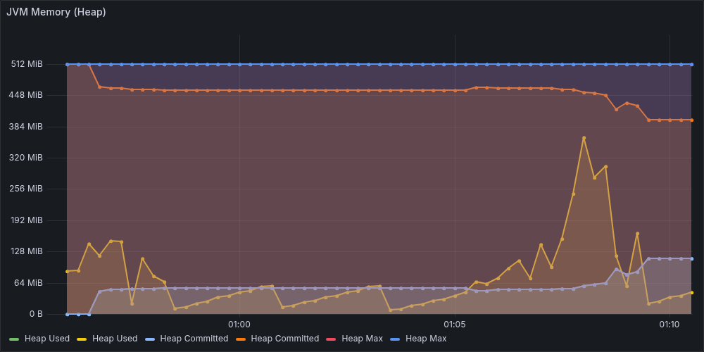

# Notes — Performance Concepts (Learning Log)

A growing reference of performance and systems concepts encountered while building this
bidder. Each section answers a specific "why is the system behaving this way?" question
triggered by a real test run, dashboard observation, or code change. Add new entries
whenever a fresh "huh, why?" comes up — keep them concrete (point to the run/panel that
prompted the question) rather than abstract.

**Index:**

| Concept | Triggered by |
|---|---|
| [JVM heap — why "Committed" sits at the max](#jvm-heap--why-committed-sits-at-the-max) | H.1 baseline JVM Memory panel |
| [Cold cache vs cold JIT — the spike at test start](#cold-cache-vs-cold-jit--the-spike-at-test-start) | H.1 baseline first-30s p99.9 spike |

---

## JVM heap — why "Committed" sits at the max

**Triggered by:** Phase 17 H.1 baseline in Grafana. The **JVM Memory (Heap)** panel
showed the "Committed" line pinned at 512 MiB throughout the test. Looked alarming at
first — was the heap full? — but it's the production pattern we explicitly chose.

### What you actually see on the dashboard



The flat horizontal band at the top is **Committed + Max** sitting on top of each other
at 512 MiB. The wavy band oscillating around 100–200 MiB is **Used** — that's the only
line tracking actual heap pressure, and it's at ~25% of the cap with plenty of headroom.

Three lines in that panel mean three different things:

| Line | What it is | Production target |
|---|---|---|
| **Heap Max** | The ceiling set by `-Xmx` | Whatever you sized for |
| **Heap Committed** | Memory the JVM has already reserved from the OS | Should equal Max in low-latency services |
| **Heap Used** | Actual live data the JVM holds | Way below Max — the only number that signals pressure |

If "used" climbs and approaches "max", that's a real concern. If "committed" sits at "max"
from startup, that's by design.

---

### Why we set `-Xms == -Xmx`

```makefile
JVM_PROD := ... -Xms512m -Xmx512m -XX:+AlwaysPreTouch ...
```

| Flag | What it does |
|---|---|
| `-Xms512m` | Initial heap size when JVM boots |
| `-Xmx512m` | Maximum heap size the JVM is allowed to grow to |
| `-XX:+AlwaysPreTouch` | At startup, write a zero to every heap page so the OS commits it immediately |

**If `Xms < Xmx`** (the JVM default behaviour), the heap grows on demand. Each "grow" event:
1. Asks the OS for more memory pages
2. Triggers a full GC to compact existing live data into the bigger space
3. Updates internal data structures

That sequence takes **tens to hundreds of milliseconds**, and during it your service is
either paused or running with degraded throughput. For a 50ms-SLA bidder, that's an SLA
violation event waiting to happen. Pinning `Xms == Xmx` removes the ability to resize, so
you get one steady heap size for the lifetime of the process.

---

### Why `+AlwaysPreTouch`

Even with a fixed-size heap, the OS by default allocates physical pages **lazily** — it
hands the JVM a virtual address range immediately, but doesn't back it with actual RAM
until the JVM tries to write to a page.

The first write to an unmapped page triggers a **page fault**: the kernel has to:
1. Find a free physical page
2. Zero it (Linux/macOS guarantee zeroed pages for security)
3. Update the process page table
4. Resume the user thread

Cost: typically **20–80 microseconds per fault**, sometimes more under memory pressure.

In a low-latency service, this fault cost shows up as latency spikes the **first time**
any heap region is used at runtime — random tail spikes for the first few seconds after
deployment, then the curve flattens. That pattern (tall p99.9 spike at test start, then
near-zero) is exactly what you saw in the H.1 baseline panel.

`+AlwaysPreTouch` makes the JVM walk every page of the heap at startup and write a zero,
which **forces the page faults to happen during JVM init** instead of during request
processing. You pay maybe 1–2 seconds of extra startup time and get a flat p99 line for
the rest of the process's life.

For a service that boots once and runs for days, this is a no-brainer.

---

### How this connects to ZGC

`-XX:+UseZGC` is also in our flags. ZGC is a low-pause garbage collector:

- Stop-the-world pauses sub-millisecond regardless of heap size (we measured 0.011ms avg
  in v1 H.4)
- Concurrent marking and relocation — the application keeps running during most GC work
- Generational since Java 24 (default; the explicit `-XX:+ZGenerational` flag was
  removed in Java 24+)

The pre-touched, fixed-size heap **is what lets ZGC stay sub-millisecond.** With a
dynamic heap, ZGC would be chasing a moving target — every resize triggers a full
collection cycle and re-init of internal data structures. With `Xms == Xmx`, ZGC initialises
once and operates on a known, stable region for the process lifetime.

---

### The "Used" line is what matters

Rule of thumb for production:

| Used / Max | What it means |
|---|---|
| Under 50% | Plenty of headroom |
| 50–70% | Steady state for a busy service — fine |
| 70–85% | GC is working hard but coping |
| Over 85% | Real memory pressure — pauses lengthen, allocation stalls appear |
| Approaches Max | Out-of-memory imminent |

Phase 17 baseline showed used at ~128 MiB / 512 MiB = **25%**. v1's most stressful run
(H.2 ramp to 1000 RPS) peaked at ~164 MiB = **32%**. We have enormous headroom and could
serve much higher load on this same heap size.

If we ever wanted to shrink the heap (containerised deployments where memory is the
billing dimension), 256 MiB would still leave us at 64% utilisation under load — viable.
We'd need to test with the larger 1000-campaign + 500K-cache footprint first because
that's where heap usage grew.

---

## Cold-cache vs cold-JIT — the spike at test start

The H.1 baseline showed a brief p99.9 spike to ~25–30 ms in the **first 30 seconds**,
then fell to flat near-zero for the remaining 90 seconds. That's two separate "cold start"
effects stacked. Both are unavoidable but bounded; both go away within seconds and don't
recur for the life of the process.

### Cold cache

Our `CachedUserSegmentRepository` is a Caffeine LRU sized 500,000 entries, TTL 60s.
At process start the cache is empty. Each user's first appearance triggers:

```
request → cache.get(userId) → miss → delegate.getSegments(userId) → Redis SMEMBERS
       ← ~1ms round-trip ← Redis returns segments ← network ←
       cache.put(userId, segments)
```

Subsequent requests for the same user return in ~100 ns from in-memory `ConcurrentHashMap`.
The transition from "everyone's a miss" to "nearly everyone's a hit" is the warmup curve.

**How to read it on the dashboard:**

| Metric | Cold | Warm |
|---|---|---|
| `cache_user_segments_hit_ratio` | climbing from ~0.0 toward 1.0 | flat near 0.99+ |
| `redis_client_command_duration_seconds{command="smembers"}` rate | high during warmup | falls dramatically |
| Pipeline stage `UserEnrichment` p50 | ~1 ms (Redis hit per request) | ~0.001 ms (cache hit) |

Warmup time scales with cache size and traffic distribution. With 1M users uniform and
100 RPS, the cache will be ~6,000 entries deep after a 60s window — only ~0.6% of unique
users have been seen. Hit ratio at that point is still climbing. That's why higher-RPS
runs (H.2 ramp) show **flatter latency throughout** — the cache fills faster relative to
the test duration.

### Cold JIT

HotSpot is a **tiered, profiling JIT compiler**. Java bytecode does not run as native
machine code immediately; it goes through stages:

| Tier | What runs | Speed |
|---|---|---|
| Interpreter | Bytecode walked instruction-by-instruction | Slowest — baseline |
| C1 (Client Compiler) | Native code, light optimisation | ~5–10× faster than interpreter |
| C2 (Server Compiler) | Native code, aggressive inlining + escape analysis + vectorisation | ~2–3× faster than C1, ~20–30× faster than interpreter |

Promotion between tiers is **invocation-count driven**:

| Threshold (default) | Triggers |
|---|---|
| Method called ~10,000 times | Eligible for C1 compilation |
| C1-compiled method called ~100,000 times | Eligible for C2 recompilation |

(These are the `-XX:CompileThreshold` / `Tier4InvocationThreshold` defaults; OpenJDK has
moved to a more adaptive heuristic but the order of magnitude is the same.)

For our hot path (`BidPipeline.execute()`, the eight stage `process()` methods, JSON
codecs) at 100 RPS:
- Each stage runs ~100 times/second
- Reaches C1 threshold (~10K calls) after ~100 seconds — well within a 2-minute test
- Reaches C2 threshold (~100K calls) after ~1000 seconds at 100 RPS, but **much faster
  at higher RPS** — at 1000 RPS, full C2 by ~100s

That's why the latency curve is so dramatic at low RPS (long warmup) but barely
visible at high RPS (warmup completes in seconds). It's also why production services
sometimes do **synthetic warmup traffic** before opening the real load balancer — burn
through the JIT thresholds with throwaway requests so real traffic never sees the cold curve.

### Observing JIT activity

If you ever want to see this happening in real time:

```bash
# Add to JVM flags during a debug run
-XX:+PrintCompilation -XX:+UnlockDiagnosticVMOptions -XX:+PrintInlining
```

You'll see a flood of lines like `1234  256 %     4   com.rtb.pipeline.BidPipeline::execute @ 18 (243 bytes)`:
- `1234` — milliseconds since JVM start
- `256` — compilation order
- `%` — on-stack-replacement (OSR), means a long-running loop got compiled mid-execution
- `4` — tier (4 = C2)
- The rest — class, method, and bytecode size

Watching this scroll past is the most concrete way to see "this method just got promoted
from interpreted to C1 to C2" in real time.

### Deoptimization — the gotcha

JIT-compiled code can be **deoptimized** back to the interpreter if the runtime decides
its assumptions were wrong. Common triggers:

- A method's profiled type assumption was violated (e.g., compiled for `ArrayList`,
  saw a `LinkedList`)
- A class hierarchy changes (rare in production, common during dev hot-reloading)
- Uncommon-trap branches actually execute (the compiler optimised the common path
  and put the rare path in a slow handler)

When this happens you see a latency spike that looks like a fresh cold start, mid-process.
Diagnose with `-XX:+PrintCompilation` looking for `made not entrant` messages. Almost
always indicates a polymorphic-callsite bug or excessive reflection/proxy use.

For our codebase: the pipeline stages are `final` classes wired at startup, no reflection
on the hot path, no proxies — deoptimization should never happen at runtime. If it does,
that's a real bug worth investigating.

---

## Sources / further reading

- [Aleksey Shipilëv — JVM Anatomy Quark #2: Transparent Huge Pages](https://shipilev.net/jvm/anatomy-quarks/2-transparent-huge-pages/) — practical impact of preTouch and pages
- [OpenJDK ZGC documentation](https://wiki.openjdk.org/display/zgc/Main) — sub-ms pause architecture
- [Brendan Gregg — Linux Page Faults](https://www.brendangregg.com/perf.html) — the kernel-side cost of an unhandled page reference
