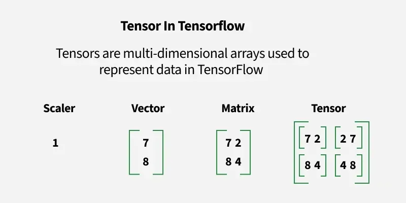
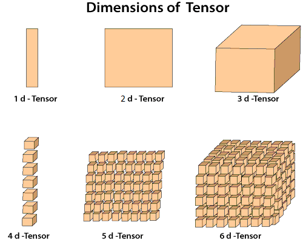
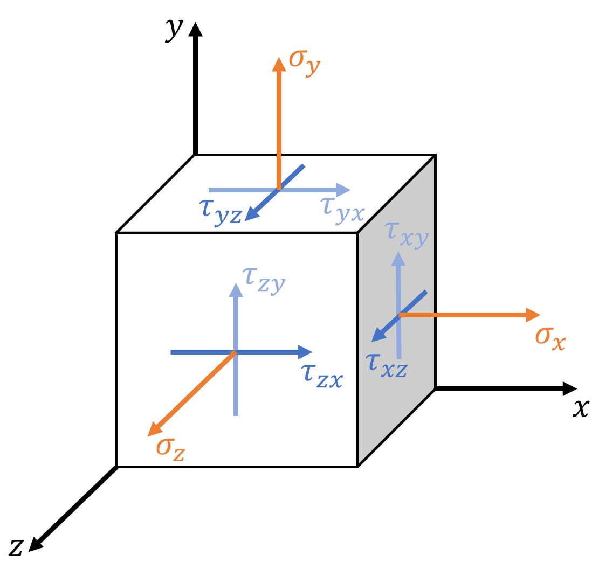

# Tensor Basics — Notes

<table>
  <tr>
    <td></td>
    <td></td>
  </tr>
  <tr>
    <td><em>Figure 1: Scalar, Vector, Matrix, and 3D Tensor</em></td>
    <td><em>Figure 2: Dimensions of tensors — 1D through 6D</em></td>
  </tr>
</table>

---

## But first — what IS a tensor and why is it called that?

In deep learning, we casually say "tensor = multi-dimensional array." That's *how* you use it, but not *what* it actually is. The name comes from physics/math, and understanding the real meaning gives you intuition for why everything in deep learning works the way it does.

### Building up from first principles

**Scalar (rank 0)** — a single number. One dimension: none. Just a value.

$$\text{mass} = 5 \text{ gm}$$

> 5gm of calcium + 3gm of calcium = **8gm**. Simple addition. Done. ✓

**Vector (rank 1)** — a list of numbers. One dimension: length.

$$\vec{v_1} = \begin{bmatrix} 5 \\ 6 \end{bmatrix}, \quad \vec{v_2} = \begin{bmatrix} 3 \\ 1 \end{bmatrix}$$

$$\vec{v_1} + \vec{v_2} = \begin{bmatrix} 5+3 \\ 6+1 \end{bmatrix} = \begin{bmatrix} 8 \\ 7 \end{bmatrix} \text{ m/s}$$

> You're moving at 8 m/s in x and 7 m/s in y. You can add them, you can visualize the result as a single arrow. ✓

**But what if components can't be added like that?**

### The stress tensor — the "aha" example

Imagine a solid block of metal under pressure. At every point inside, forces push on surfaces. But force depends on **which direction the surface faces**. So you need to describe the *relationship* between "surface direction" and "force."

<figure>
  
  <figcaption><em>Figure 3: Stress tensor — orange (σ) = normal stress (pushes straight out), blue (τ) = shear stress (pushes sideways)</em></figcaption>
</figure>

Look at the **right face** of the cube (the face that points in x-direction):
- $\sigma_x$ (orange →) — force pushing **straight out** in x. This is **normal stress** (compression or tension)
- $\tau_{xy}$ (blue ↑) — force pushing **sideways in y** on that same x-facing surface. This is **shear stress**
- $\tau_{xz}$ (blue ↗) — force pushing **sideways in z** on that same x-facing surface. Also shear

Now look at the **top face** (points in y-direction):
- $\sigma_y$ (orange ↑) — normal stress, pushes straight out in y
- $\tau_{yx}$ (blue →) — shear, pushes sideways in x on the y-facing surface
- $\tau_{yz}$ (blue ↗) — shear, pushes sideways in z on the y-facing surface

Same pattern for the **front face** (z-direction): $\sigma_z$, $\tau_{zx}$, $\tau_{zy}$.

That's **9 numbers** — 3 faces × 3 force directions each. They form a 3×3 grid:

$$\sigma = \begin{bmatrix} \sigma_x & \tau_{xy} & \tau_{xz} \\ \tau_{yx} & \sigma_y & \tau_{yz} \\ \tau_{zx} & \tau_{zy} & \sigma_z \end{bmatrix}$$

In the **matrix**, the positions [1,1], [2,2], [3,3] form the "diagonal" — these are the normal stresses. In the **image**, they're the 3 orange arrows (one per face, pushing straight out). The off-diagonal positions are the shear stresses — the blue arrows pushing sideways.

$$\sigma = \begin{bmatrix} \underbrace{\sigma_x}_{\text{orange on x-face}} & \underbrace{\tau_{xy}}_{\text{blue on x-face}} & \underbrace{\tau_{xz}}_{\text{blue on x-face}} \\ \underbrace{\tau_{yx}}_{\text{blue on y-face}} & \underbrace{\sigma_y}_{\text{orange on y-face}} & \underbrace{\tau_{yz}}_{\text{blue on y-face}} \\ \underbrace{\tau_{zx}}_{\text{blue on z-face}} & \underbrace{\tau_{zy}}_{\text{blue on z-face}} & \underbrace{\sigma_z}_{\text{orange on z-face}} \end{bmatrix}$$

Notice: the image shows all **9 individual components** on the cube — but no combined resultant force. That's because the tensor stores the *recipe*, not the answer. The answer only appears when you ask a specific question:

**"What's the total force on a surface facing direction $\vec{n}$?"**

$$\vec{T} = \sigma \cdot \vec{n} = \begin{bmatrix} \sigma_x & \tau_{xy} & \tau_{xz} \\ \tau_{yx} & \sigma_y & \tau_{yz} \\ \tau_{zx} & \tau_{zy} & \sigma_z \end{bmatrix} \begin{bmatrix} n_x \\ n_y \\ n_z \end{bmatrix} = \begin{bmatrix} T_x \\ T_y \\ T_z \end{bmatrix}$$

> *Input: surface direction $\vec{n}$ (a vector) → Output: force on that surface $\vec{T}$ (a vector)*

**This is what a rank-2 tensor does.** It's a machine that takes a vector in and gives a vector out. The 3×3 grid stores the "recipe" — how every input direction maps to every output direction.

### This is exactly what a neural network layer does

$$\vec{y} = W \cdot \vec{x} = \begin{bmatrix} w_{11} & w_{12} & w_{13} \\ w_{21} & w_{22} & w_{23} \end{bmatrix} \begin{bmatrix} x_1 \\ x_2 \\ x_3 \end{bmatrix} = \begin{bmatrix} y_1 \\ y_2 \end{bmatrix}$$

> *Input: features $\vec{x}$ (a vector) → Output: transformed features $\vec{y}$ (a vector)*

**Same exact math. Same exact idea.**

| | Physics (stress tensor) | Deep learning (nn.Linear) |
|---|---|---|
| **The tensor** | $\sigma$ — a 3×3 grid | $W$ — a weight matrix |
| **What it stores** | How each surface direction maps to each force direction | How each input feature maps to each output feature |
| **Input** | Surface normal $\vec{n}$ — "which way does the surface face?" | Input features $\vec{x}$ — "what are the values?" |
| **Output** | Force $\vec{T}$ — "what force does that surface feel?" | Output features $\vec{y}$ — "what does the layer produce?" |
| **The operation** | $\vec{T} = \sigma \cdot \vec{n}$ | $\vec{y} = W \cdot \vec{x}$ |
| **What is it really?** | Matrix × vector = vector | Matrix × vector = vector |

### So what IS "rank"? And what are "dimensions"?

**Rank = number of dimensions = how many indices you need to pick out a single number.**

Think of it like an address system:
- A house on a **single road** → you need 1 number (house #5) → **1 dimension**
- A house in a **city grid** → you need 2 numbers (street 3, house 5) → **2 dimensions**
- An apartment in a **city** → you need 3 numbers (street 3, house 5, floor 2) → **3 dimensions**

Each new "axis" you need to locate a value = one more dimension = one higher rank.

**Example:** the stress tensor $\sigma$ is a 3×3 grid. To get one value like $\sigma_{xy}$, you need **two indices** — which row (x) and which column (y). Two indices → rank 2 → 2D.

A vector like $\vec{v} = [5, 6, 3]$ needs **one index** — `v[0]=5, v[1]=6, v[2]=3`. One index → rank 1 → 1D.

| Rank | Dimensions | What it is | In plain english | How to read it | Example |
|------|-----------|-----------|-----------------|---------------|---------|
| 0 | 0D | **Scalar** | A single number, no axes at all | Just `x` | Loss = `3.14` |
| 1 | 1D | **Vector** | A list — one axis (length) | One index: `x[i]` | Embedding = `[0.2, -0.5, 0.8, ...]` with 768 values |
| 2 | 2D | **Matrix** | A table/grid — two axes (rows, columns) | Two indices: `x[i][j]` | Weight matrix `[768, 768]` — each cell = "how much input j affects output i" |
| 3 | 3D | **3D tensor** | A stack of tables | Three indices: `x[a][b][c]` | A sentence = `[seq_len, embed_dim]` — but what if you have a batch? Stack them → `[batch, seq, dim]` |
| 4 | 4D | **4D tensor** | A stack of stacks of tables | Four indices: `x[a][b][c][d]` | One image = `[3, 224, 224]` (RGB). A batch → `[batch, 3, 224, 224]` |

> **Rank, dimensions, number of axes — all the same thing.** A vector is a 1D tensor. A matrix is a 2D tensor. "Tensor" is just the general word that covers all of them.

### Can a weight matrix be higher than rank 2?

**Yes!** A rank-2 weight matrix is the simplest case (`nn.Linear`). But:

- **Convolution filters** are rank-4 tensors: `[out_channels, in_channels, kernel_h, kernel_w]` — each "cell" says "how much does this pixel in this input channel contribute to this output channel?"
- **Attention weights** in a transformer are rank-4: `[batch, heads, seq, seq]` — for each head, for each token, how much attention does it pay to every other token?
- **Embeddings** are rank-2: `[vocab_size, embed_dim]` — each row is one word's vector

The pattern is always the same: **the tensor stores a relationship, and you look up values by indexing into its dimensions.**

So when PyTorch calls everything a "tensor," it's not fancy naming — **every operation in deep learning is tensor math**:
- `nn.Linear` is matrix × vector (rank-2 × rank-1 → rank-1)
- Attention scores $QK^T$ is matrix × matrix (rank-2 × rank-2 → rank-2)
- A batch of images `[batch, channels, height, width]` is rank-4 — four dimensions that belong together but each means something different

---

## Q&A — things that weren't obvious

**Q: The image shows 9 separate force arrows on 3 faces. Doesn't all of that combine into one resultant force somewhere in the center?**

No. The 9 arrows are forces on **different surfaces**. The x-face has 3 forces ($\sigma_x, \tau_{xy}, \tau_{xz}$) — those do combine into one resultant on that face. But forces on the x-face and forces on the y-face can't be added — they act on different things. A tensor keeps them separate because the answer **depends on which surface you ask about**.

**Q: What does "the tensor stores the recipe, not the answer" actually mean?**

A tensor is like a function — it holds the **rule**, not any specific result. The result only appears when you give it an input:

| | The "recipe" (stored) | The "question" (input) | The "answer" (output) |
|---|---|---|---|
| Stress tensor | $\sigma$ (9 components) | Surface direction $\vec{n}$ | Force on that surface $\vec{T} = \sigma \cdot \vec{n}$ |
| Neural network layer | Weight matrix $W$ | Input features $\vec{x}$ | Output features $\vec{y} = W \cdot \vec{x}$ |
| Attention | $\text{softmax}(QK^T)$ | Value vectors $V$ | Context-weighted output |

Same tensor, different input → different answer. The tensor is a **transformation machine** waiting for a query.

**Q: So a tensor is essentially a knowledge base — you feed it an input and get an output?**

Close, but not quite. A knowledge base **stores facts** and looks them up — ask "what is Paris?" and it returns a stored answer. A tensor doesn't store answers. It stores a **transformation rule** and applies it blindly to whatever you give it.

Better analogy: a tensor is a **lens**, not a library.

```
Library (knowledge base):  you ask about X → returns a stored fact about X
Lens (tensor):             X passes through → comes out changed, regardless of what X is
```

A stress tensor doesn't "know" anything about the surface direction $\vec{n}$ you give it. It blindly multiplies and out comes a force. A weight matrix doesn't "know" anything about your input features. It blindly multiplies and out comes a transformed vector.

```
Stress tensor:     surface [1, 0, 0]  →  force [σ_x, τ_yx, τ_zx]     (just math, no "understanding")
nn.Linear:         input [0.5, -0.2]  →  output [0.8, 0.1, -0.3]     (just math, no "understanding")
```

The reason neural networks seem intelligent is NOT because one weight matrix "knows" things — it's because **hundreds of these lenses stacked together** learn to bend the signal in useful ways. Each individual tensor is dumb. The stack is smart.

**One exception:** embedding layers ARE closer to a knowledge base — each word has a stored vector, and you look it up by index. That really is a lookup table. But `nn.Linear` weight matrices are transformations, not lookups.

**Q: A vector can be fully represented as magnitude + angle. Can a tensor be represented in some compact form too?**

A vector $\vec{v} = [3, 4]$ has 2 components. You can rewrite it as:

$$|\vec{v}| = 5, \quad \theta = 53° \quad \text{→ still 2 values, no info lost, just a different form}$$

This works because a vector is simple — it's just a **single direction with a strength**. Two numbers fully describe it either way.

A rank-2 tensor like the stress tensor has **9 components** — it encodes a relationship between every input direction and every output direction. There's no equivalent compact form. You can't say "the stress tensor has magnitude 7 at angle 30°" because it's not pointing in any single direction. It describes **all directions at once**.

| | Components | Can you represent compactly? | Why? |
|---|---|---|---|
| Scalar | 1 | Already compact — it's just a number | Nothing to simplify |
| Vector (2D) | 2 | Yes → magnitude + angle (2 values → 2 values) | One direction, one strength |
| Vector (3D) | 3 | Yes → magnitude + 2 angles (3 values → 3 values) | Still one direction, one strength |
| Rank-2 tensor | 9 | No equivalent — 9 independent relationships | Not one direction — it maps **every** direction to an output |

**This is exactly why tensors exist as a concept.** If the stress tensor could be described with a magnitude and angle, it would just be a vector. The whole point is that it carries more information than a vector can — it encodes a full **mapping**, not just a single arrow.

---

## Key takeaways
